```{r setup, include=FALSE}
knitr::opts_chunk$set(echo = TRUE)
library(tidyverse)
library(tidytext)
library(dplyr)
library(readr)
library(tidyr)
library(writexl)
library(readxl)
library(textdata)
library(ggplot2)
library(scales)
library(ggrepel)
```

# Summary

The Goldberg Gator Engineering Explorers (GGEE) Summer Program was designed to provide middle school students with an authentic experience in programming, engineering design, and computational thinking. The 2023 Summer Program successfully engaged 319 students across 8 school districts. Students developed computational thinking skills through design-based challenges using micro:bit micro-controllers. 

Schools and Districts partnered with the GGEE program to host programs and sponsor teachers and materials for the programs at their schools. There were 20 local teachers that lead summer programs in their area. Twenty undergraduate engineering students from the University of Florida and neighboring colleges and universities supported teacher leaders and served as mentors for students in the program. Both teachers and undergraduate mentors were trained in program activities to upskill their abilities in programming, computational thinking, engineering desgin, and teaching practices. Two grant staff coordinated and ran the programs. 

----DATA 

Demographics
How students enjoyed the program
Growth from beginning to end

Follow up after-school programs in 5 districts for 12 sessions with around 200 students participating in the program. 

Program costs per student 

**Last year summary**
*Students reported they felt challenged during the program but were rewarded when their code or design worked. They also mentioned the importance of collaboration with peers to solve engineering problems, and they enjoyed the mentorship of the college students working with the program. The longitudinal effects of the summer program on grades in math and science and students' enrollment in higher-level courses will be tracked by the research study for the program. All districts provided in-kind donations to the camp, and many school districts have plans to host or expand the programs for next year. Some schools have asked about follow-up programming, including afterschool programming to continue student engagement. The cost per student for the program was $996, including all costs for program development (three months), camp costs (two months), and post-assessment of the program. The cost per student for future camps should be less owing to development costs built into the program's first year.*


# Introduction

## Background

The Goldberg Gator Engineering Explorers (GGEE) Summer Program was initiated by a generous donor, Arnold Goldberg, to the University of Florida Foundation. He envisioned a free summer program for underrepresented minority middle school students. The program would allow students and teachers to experience computer science and have opportunities to learn to not only program but build skills in computational thinking, problem solving, and engineering design. The vision was brought to life by the Engaging Quality Instruction through Professional Development (EQuIPD) grant at the University of Florida. Their team worked with schools, districts, and teachers across Florida to host these programs.

The GGEE Program was designed to introduce middle school-aged students to programming and computer science. The program begins with students learning the base elements of coding through small activities that engage them in applying concepts such as strings, conditional statements, loops, and variables. They use these concepts and the micro:bit to develop a simple game and to also collect and analyze light intensity data to study the relationship of light intensity and distance. The program then has students working on two scaling design challenges with partners and teams. The first is a creative engineering design challenge where they create a micro:bit pet for a partner. Then second is a technical design challenge where teams create a solution to a local problem - traffic lights for emergency service vehicles, environmental sensors for a farmer, and an indicator for new drivers. 

An Advanced Program was developed and piloted during the second year of the GGEE programs to allow returning students to continue to participate in the GGEE programs. The program was designed to introduce students to the basic concepts of Artificial Intelligence with a focus in Machine Learning. The Advanced Program session designed to be held over 4 full-days. Registrations were open to students who previously attended the GGEE program in 2022. 

## Purpose of the Report

This funding report provides an overview of the 2023 Goldberg Gator Engineering Explorer Summer Programs. The report provides details from preparing for the summer programs, during the summer program, and information about what follows the programs as well as suggestions for next year's programs. 

# Preparation for GGEE Programs

To prepare for the GGEE Summer Programs, the EQuIPD team worked to recruit school districts, students, and prepare required research documentation. 

## School District Recruitment

*Detail the strategies used to recruit students for the program. Discuss any partnerships or collaborations that helped with recruitment efforts.*

**October 2022**

Emails were sent to schools and districts to invite them to participate in the 2023 Goldberg Gator Engineering Explorer Programs. Correspondence was sent to schools that participated in the 2022 pilot programs in addition to all of the school district leaders in Career and Technical Education across Florida. The email provided an overview of the program and it's pilot run in 2022. It also contained a survey for schools or districts to sign up to show their interest and to learn more about the program in an upcoming information session. These emails were distributed multiple times up until the information session. 

The information session was held on October, 13th, 2022 and had 11 registrants from Broward, Hillsborough, Lake, Manatee, Miami-Dade, Palm Beach, Santa Rosa, and St. Lucie counties. Orange, Pinellas, and Sarasota counties were also interested in the GGEE Programs and had either participated in the pilot programs or were particiapting in another EQuIPD gratn program and wanted to host a summer program. 

**November - April 2022**


School recruitment for the 2023 GGEE Summer Programs began in November of 2022. Flyers were shared via email to school administration 


```{r Program_Fund, echo=FALSE}

library(readxl)
library(knitr)

GGEE_23_School_Districts_fund <- read_excel("Data/GGEE_23_School Districts_table.xlsx", sheet =2)

knitr::kable(GGEE_23_School_Districts_fund, caption = "2023 Goldberg Gator Engineering Summer Program location funding sources. ", "simple")

```


## Student Recruitment

*Explain the criteria used to select participants for the program. This could include grade level, academic standing, or other factors.*

School Recruitment

## Research and Youth Compliance 

### Research

- IRB filed through UF for research
- Research questions
- Surveys
- Interview Protocols
- Parent Research Consent

### Youth Compliance

- Mentors Level 2 Background Screening and Fingerprinting for Jessica Lundsford Act
- School district partnership covered compliance for their teachers 
- UF Youth Compliance Training 
- UF Waiver liability......for Parents 


# Scheduling Summer Programs

## 2022 vs. 2023

The program was piloted during the Summer of 2022 with eight sessions and six school districts. The program served just over 100 hundred students. The pilot summer program paved the way for a pilot year of virtual after-school programs during the 2022-2023 school year. Student joined the sessions remotely from home. The 2023 summer program #################################


<center>
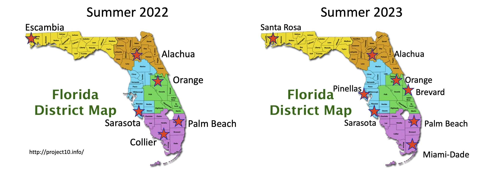
</center>

```{r Programs, echo=FALSE}

library(readxl)
library(knitr)
GGEE_23_School_Districts_table <- read_excel("Data/GGEE_23_School Districts_table.xlsx")

knitr::kable(GGEE_23_School_Districts_table, caption = "2023 Goldberg Gator Engineering Summer Program Locations, Programs, and Formats.", "simple")

```

## Program Calendar

*Provide an overview of the program's calendar, including the duration of the program, daily schedules, and key activities.*

There were X many programs in each district


<center>
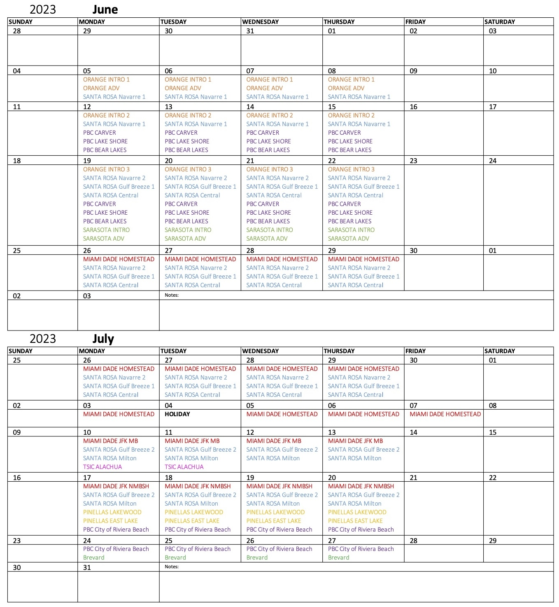{ width=100%}
</center>

# Program Layouts

## Introductory Programs

<center>
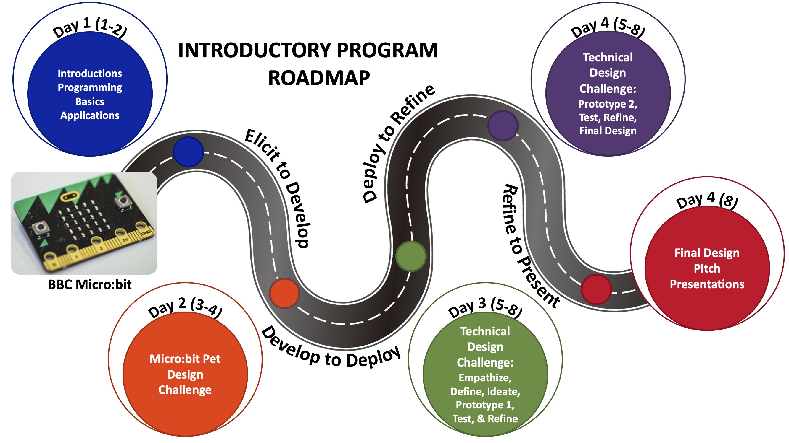{ width=80%}
</center>

## Advanced Programs

The Advanced Program was formatted as 4 day program in all the pilot schools, Figure ^. On Day 1, Students were introduced to the basic concepts of artificial intelligence and then machine learning. The day was concluded with an introduction to programming in [Scratch](https://scratch.mit.edu/) to prepare for the following day. 

On Day 2, students were introduced to Image-based and Test-based machine learning models from [Machine Learning for Kids](https://machinelearningforkids.co.uk/). Classrooms were set up and students were given a login and password unique to their session location. Students develop and train a image-based machine learning model that analyzes the color characteristics of different types of Pokémon. Students then build and train a text-based machine learning model to develop a smart classroom with electronic devices that power on or off using a variety of commands. 

On Day 3, students use their micro:bit programming skills from the previous summer program combined with their new machine learning skills to program a micro:bit to be able to identify different types of gestures. During this activity, students built their own sets of training data using the micro:bits. Students would program 2 gestures together as a class and then make up to 5 gestures on their own. There were at least 20-30 data points for each gesture. The machine learning models were trained using a decision tree constructed in Python and hosted in a Juypter Notebook on [NanoHub](https://nanohub.org/). The model was loaded onto the micro:bit and the model would identify gestures based on the training data provided. 

On Day 4, students were introduced to Neural Networks. The activity walked them through the various types of machine learning models from decision trees to more complex neural networks. Students learned about the multiple layers in a neural network and the processes that each of those layer serve. The following activity had students develop and train a neural network to identify images of numbers. Students manipulated the number of nodes and studied the effect on the outcame and weights in identifying each number. This activity concluded the program. 

<center>
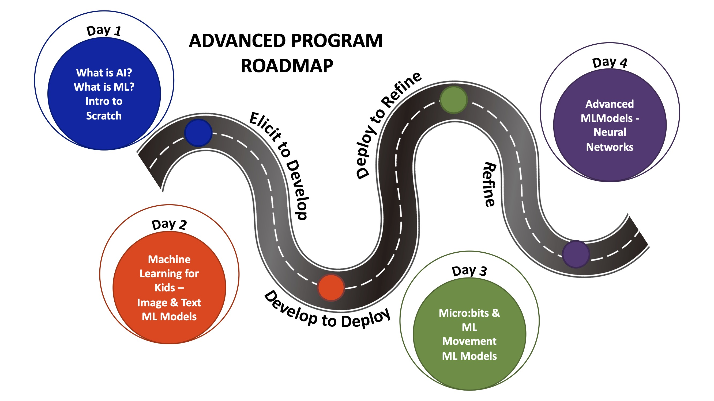{ width=80%}
</center>

## 4-Day Programs


## 8-Day Programs


# Student Enrollment & Demographics

## Enrollment Statistics
*Present enrollment data, including the number of students who initially registered, and any changes over the course of the program.*

Programs were able to host up to 25 students in each of their program sessions. Registrations were closed and students were placed on wait lists in the case of cancellations by student parents. 
Programs had on average X number of students enroll. Wait lists ranged from 5 - 80 students in some districts.

Bar Graph Comparison - 
Total Number of Registered Students - stacked bar graph - registered vs waitlist

**GRAPH by Session - stacked graph - regsitered vs waitlist**

Need for more programs in Santa Rosa County District Schools


## Attendance Records
*Share attendance records to illustrate the level of student engagement and participation throughout the program.*

Actual attendance with the programs were less than initial registrations. Students became ill, were unable to attend the first days of the program or parents made new plans for their families. 

<center>
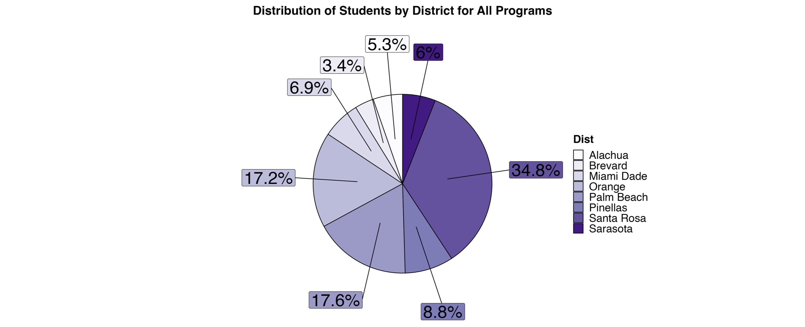{ width=55%}
</center>

<center>
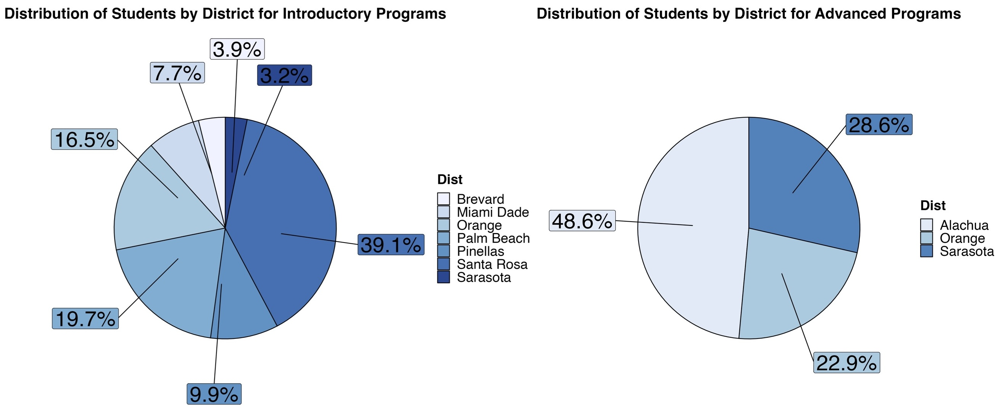
</center>


## Student Demographics

Demographics were collected from students that participated in the resaerch study. There were a total of 204 students that participated in the GGEE Summer programs. **add amounts from intro and advanced**

### Age
*Include demographic information such as age, gender, ethnicity, and socioeconomic background of the participating students.*

<center>
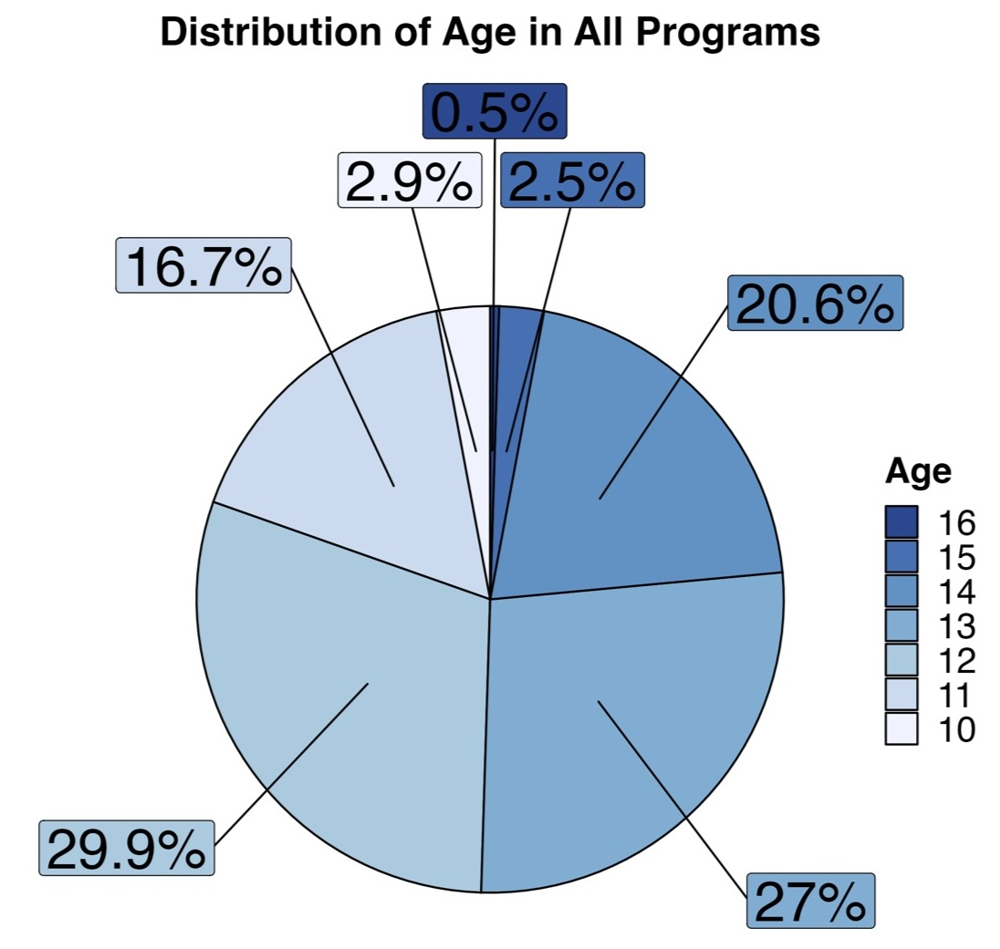{ width=45%}
</center>


<center>
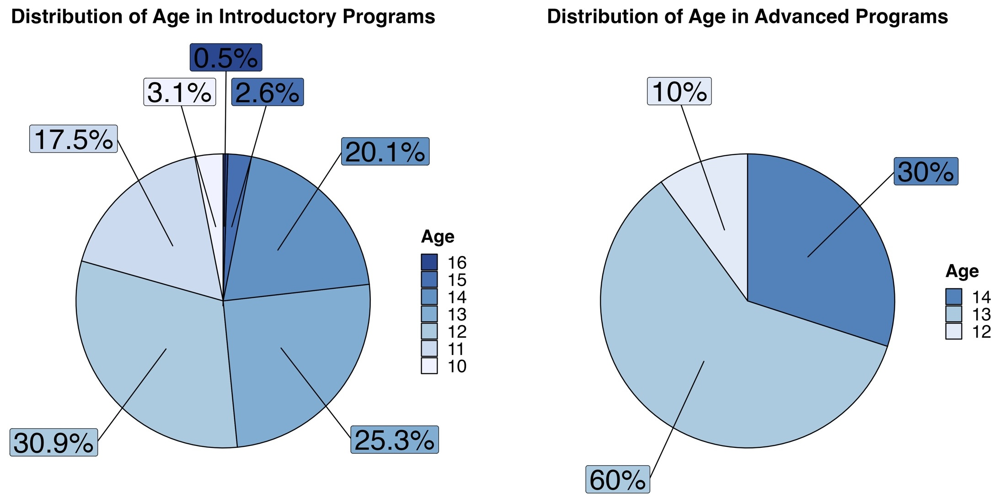{ width=85%}
</center>


### Gender

<center>
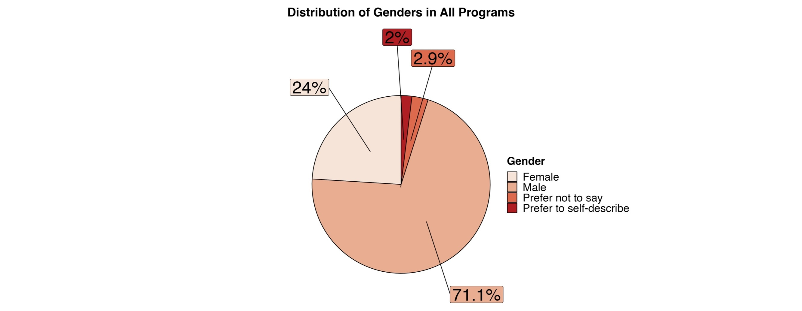{ width=50%}
</center>


<center>
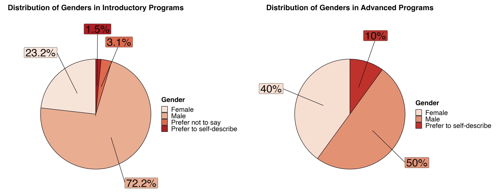
</center>


### Race and Ethnicity

- Students that chose 3 or more race and ethnicity were grouped together
- Count of students by race or ethnicity in each course 
- Many students selected multiple races or ethnicity, primary race with secondary ethniticty was listed
- Broken down into percentage of secondary race or ethnicity

<center>
{ width=80%}
</center>


<center>
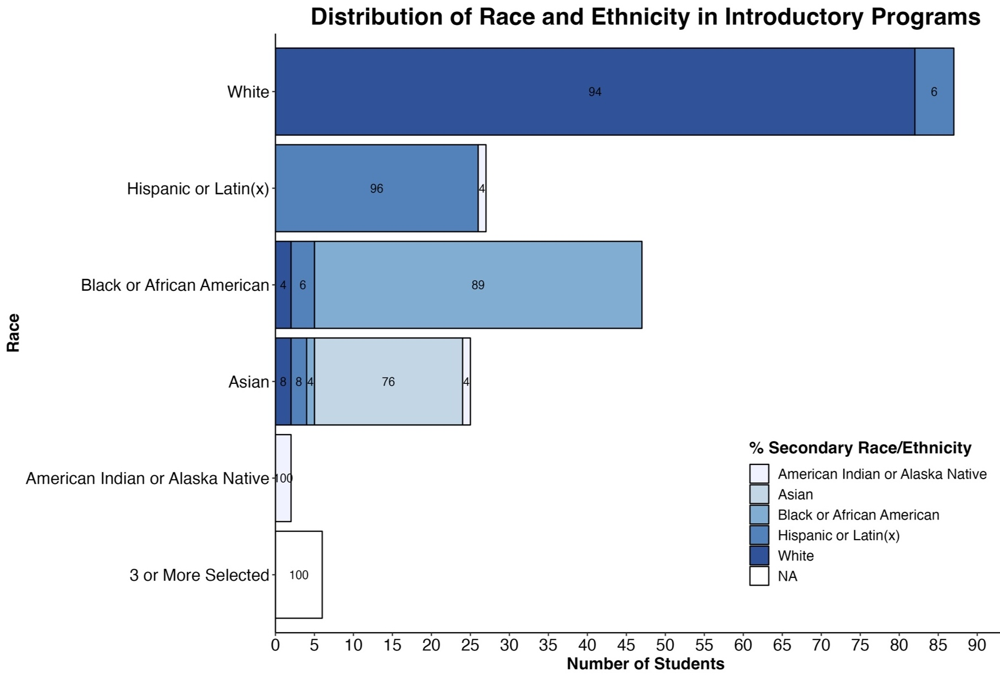{ width=80%}
</center>

<center>
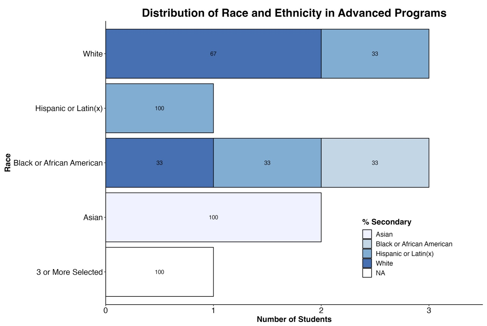{ width=80%}
</center>


# Research

## Summary of Pre-Survey Survey Results
Summarize the responses from the pre-program survey, highlighting key findings and insights.

##  Survey Responses

## Analysis of Ongoing Survey Data (if conducted during the program)
If you conducted surveys during the program, analyze the responses and share any noteworthy trends or changes over time.

## Student Interviews

### Highlights from Student Interviews
Share significant insights and quotes gathered from student interviews, emphasizing their experiences and perspectives.

## End of Program Survey Responses

### Summary of Post-Program Survey Results
Present the results of the post-program survey, emphasizing any changes in student responses compared to the pre-program survey.


# Program Outcomes

## Assessment of Program Objectives and Goals
Evaluate whether the program met its objectives and goals as outlined in the introduction.

# Challenges and Lessons Learned

## Identification of Challenges Faced
Discuss any challenges encountered during the program's implementation.

## Lessons Learned & Adaptations Made
Share lessons learned from the program's challenges and any adjustments or improvements made as a result.

# Recommendations

## Suggestions for Program Improvement
*Provide recommendations for improving the program in future iterations, based on the insights gained.*

- Updating compliance forms with more clear langaue for parent and the research study
- Make submitting paperwork a part of the registration process. Did this with the 2023-2024 After-School programs and it has made everything so much easier to process and collect rather than a 2-step process
- Creating contract-like documents to denote needs, requirments, and expectations from the schools and what is provided from the GGEE program at UF
- Starting Recruitment in November
- ensuring districts cover technology to continue to use in after-school programs or integrate into classroom projects
- revise research study to expand to get more teacher and UF undergraduate mentor insight in the program 


## Future Directions
*Suggest potential directions for the program's growth or expansion.*

# Conclusion

## Recap of Program's Successes
Summarize the program's achievements and positive outcomes.

## Reiteration of Impact on Students
Emphasize how the program benefited the participating students and the broader school community.

# Appendices

Include any supplementary materials, such as additional data charts and graphs, the complete survey questions, and interview transcripts.

Please adapt this template to your specific program and add more details and content as needed to create a comprehensive final report for your middle school summer program.


