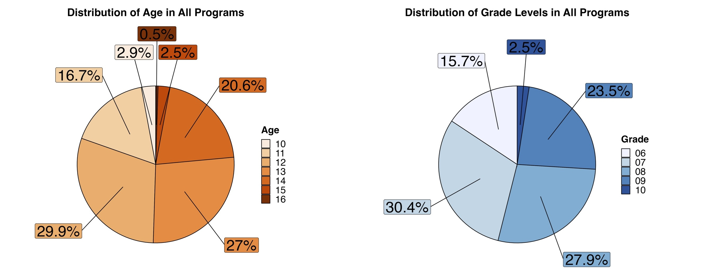
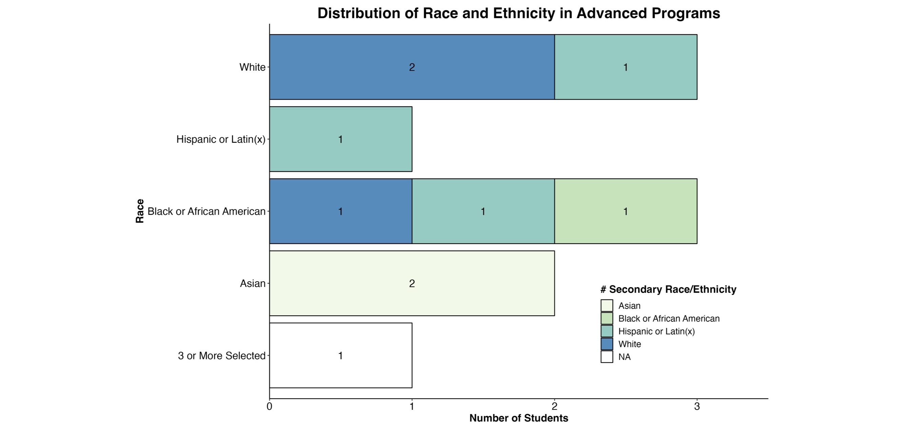

```{r setup, include=FALSE}
knitr::opts_chunk$set(echo = TRUE)
library(tidyverse)
library(tidytext)
library(dplyr)
library(readr)
library(tidyr)
library(writexl)
library(readxl)
library(textdata)
library(ggplot2)
library(scales)
library(ggrepel)
```

# Summary

The Goldberg Gator Engineering Explorers (GGEE) Summer Program was designed to provide middle school students with an authentic experience in programming, engineering design, and computational thinking. The 2023 Summer Program successfully engaged 319 students across 8 school districts. Students developed computational thinking skills through design-based challenges using micro:bit micro-controllers. 

Schools and Districts partnered with the GGEE program to host programs and sponsor teachers and materials for the programs at their schools. There were 20 local teachers that lead summer programs in their area. Twenty undergraduate engineering students from the University of Florida and neighboring colleges and universities supported teacher leaders and served as mentors for students in the program. Both teachers and undergraduate mentors were trained in program activities to upskill their abilities in programming, computational thinking, engineering design, and teaching practices. Two grant staff coordinated and ran the programs. 

In addition to the funding from donors Arnold Goldberg and Bud and Kim Deffebach, school districts, or city programs - City of Riviera Beach Youth Empowerment Programs; the Goldberg Gator Engineering Explorers summer programs received funding from the State of Florida Department of Education (291-1231C-2C001) to aid in supporting student travel, time, and providing technology. 


**Last year summary**
*Students reported they felt challenged during the program but were rewarded when their code or design worked. They also mentioned the importance of collaboration with peers to solve engineering problems, and they enjoyed the mentorship of the college students working with the program. The longitudinal effects of the summer program on grades in math and science and students' enrollment in higher-level courses will be tracked by the research study for the program. All districts provided in-kind donations to the camp, and many school districts have plans to host or expand the programs for next year. Some schools have asked about follow-up programming, including afterschool programming to continue student engagement. The cost per student for the program was $996, including all costs for program development (three months), camp costs (two months), and post-assessment of the program. The cost per student for future camps should be less owing to development costs built into the program's first year.*


# Introduction

## Background

The Goldberg Gator Engineering Explorers (GGEE) Summer Program was initiated by a generous donor, Arnold Goldberg, to the University of Florida Foundation. He envisioned a free summer program for underrepresented minority middle school students. The program would allow students and teachers to experience computer science and have opportunities to learn to not only program but build skills in computational thinking, problem solving, and engineering design. The vision was brought to life by the Engaging Quality Instruction through Professional Development (EQuIPD) grant at the University of Florida. Their team worked with schools, districts, and teachers across Florida to host these programs.

The GGEE Program was designed to introduce middle school-aged students to programming and computer science. The program begins with students learning the base elements of coding through small activities that engage them in applying concepts such as strings, conditional statements, loops, and variables. They use these concepts and the micro:bit to develop a simple game and to also collect and analyze light intensity data to study the relationship of light intensity and distance. The program then has students working on two scaling design challenges with partners and teams. The first is a creative engineering design challenge where they create a micro:bit pet for a partner. Then second is a technical design challenge where teams create a solution to a local problem - traffic lights for emergency service vehicles, environmental sensors for a farmer, and an indicator for new drivers. 

An Advanced Program was developed and piloted during the second year of the GGEE programs to allow returning students to continue to participate in the GGEE programs. The program was designed to introduce students to the basic concepts of Artificial Intelligence with a focus in Machine Learning. The Advanced Program session designed to be held over 4 full-days where students began with basic ideas of artificial intelligence and machine learning and are the scaffolded to developing basic and more complex machine learning models that are trained from text, images, and even gestures. This program was open to students who previously attended the GGEE program in 2022. 

## Purpose of the Report

The purpose of this report is to offer a comprehensive overview of the 2023 Goldberg Gator Engineering Explorer Summer Programs. Through this report, we aim to provide readers with insights into the entire lifecycle of our summer programs, starting from the preparations leading up to the program's launch, the activities and experiences that transpired throughout the summer, and essential information pertaining to post-program activities. Furthermore, this report will offer valuable suggestions and recommendations for improving and enhancing the quality and effectiveness of our future summer programs, setting the stage for continued growth and success in the years to come.

# Preparation

In preparation for the GGEE Summer Programs, the EQuIPD team actively engaged in district recruitment, student enrollment, and the meticulous preparation of essential research and compliance documentation.

## Funding

Funding for the Goldberg Gator Engineering Explorer Summer Programs came few multiple sources this year in addition to donation from Arnold Goldberg to the University of Florida's Herbert Wertheim College of Engineering. 

*State of Florida Department of Education*

The State of Florida Department of Education provided \$250,000 (291-1231C-2C001) to support the Goldberg Gator Engineering Explorer Summer Programs alongside providing training and materials for teachers around artificial intelligence. These funds supported staff time and effort, program travel, technology, and consumable materials.

*Bud and Kim Deffebach UF Foundation*

We partnered with Bud and Kim Deffebach to host both a GGEE summer program and after-school program for students in Brevard County at Stone Magnet Middle School. Their gift provided funding for the teacher to train and lead the summer and after-school programs, consumable materials, technology, and meals for the students and staff that participated in the summer program.

*City of Riviera Beach - Youth Empowerment Programs* 

The EQuIPD grant worked with the City of Riviera Beach to host a session of the GGEE program over the summer. The city provided meals for the students and a learning lab space for their Youth Empowerment Programs within their public library. A \$5,500 contract was developed between UF and the city for the city to provide funding for a teacher, technology, and consumable learning materials. The GGEE program provided funding for the student mentors supporting the program. 

*Schools and Districts*

Many of the schools and districts we collaborated with to host GGEE summer programs were able to allocated funds from the end of the year to support their teachers through training and leading sessions, technology such as micro:bits and STEM kits for the teachers to keep for their own classrooms and after-school programs, and consumable materials such as paper, pencils, pens, markers, tape, and glue. The GGEE program provided funding for student mentors time and any travel costs. Many school districts provided breakfast and lunch for students participating in the program as part of the already existing summer lunch programs. 
The estimated costs for schools were around \$4,000 for 4-day programs and around \$6,000 for 8-day half-day programs.

Table ^ displays the funding sources for each of the GGEE program sessions. A more concise breakdown of funds will be provided in an additional report.

```{r Program_Fund, echo=FALSE}

library(readxl)
library(knitr)

GGEE_23_School_Districts_fund <- read_excel("Data/GGEE_23_School Districts_table.xlsx", sheet =2)

knitr::kable(GGEE_23_School_Districts_fund, caption = "2023 Goldberg Gator Engineering Summer Program location funding sources. ", "simple", align = 'llc')

```

## Research and Youth Compliance 

### Research

A new study was filed with the University of Florida's Institutional Review Board. The study included updates from the 2022 programs. Modifications to any parent and teacher consent documents, survey questions, and survey tools, and interview protocols were documented and reviewed to ensure the research study was done ethically and appropriately with K-12 student participants. 

### Youth Compliance

The GGEE Summer Program was registered with the University of Florida's Youth Compliance department. Youth compliance requires collecting student information, parent/guardian emergency contact information, as well as information on adults working with K-12 students during the programs.

All personnel hired through the University of Florida were required to undergo a level-2 background screening along with fingerprinting to be compliant to work with minors as guided by the Jessica Lundsford Act. They also complete youth compliance training from the university to ensure they understood their role and procedures to keep themselves and students safe during the summer programs. Teachers from their local schools and districts were not required to undergo background screening from UF as they have already done so with their districts. Their information was recorded and they were added as personnel for the programs. 

## Training

School district teachers and undergraduate student mentors participated in training sessions held remotely over Zoom. Sessions were held for 2 hours once a week over the course of five weeks. Program teacher leaders attended the sessions live. During those sessions teachers completed the activities from a learner perspective so they understood how to program the activity as well as an idea of how to facilitate the activity. Teacher leads had the opportunity to ask questions regarding logistics and content during the training time. 

The undergraduate mentors participated in training in a hybrid series that took place over three days. The mentors met with the facilitator for 2 hours on Tuesday and Thursday and were expected to work on their own for 2 hours on Wednesday. The facilitator review the requirements and expectations of being a program lead and reviewed the rules for youth compliance in addition to working through the program activities with the student mentors and answering any questions regarding content or logistics. 

## School District Recruitment

*October 2022*

Emails were sent to schools and districts to invite them to participate in the 2023 Goldberg Gator Engineering Explorer Programs. Correspondence was sent to schools that participated in the 2022 pilot programs in addition to all of the school district leaders in Career and Technical Education across Florida. The email provided an overview of the program and it's pilot run in 2022. It also contained a survey for schools or districts to sign up to show their interest and to learn more about the program in an upcoming information session. These emails were distributed multiple times up until the information session. 

The information session was held on October, 13th, 2022 and had 11 registrants from Broward, Hillsborough, Lake, Manatee, Miami-Dade, Palm Beach, Santa Rosa, and St. Lucie counties. Orange, Pinellas, and Sarasota counties were also interested in the GGEE Programs and had either participated in the pilot programs or were participating in another EQuIPD grant program and wanted to host a summer program. 

*November - December 2022*

The GGEE team continued to communicate and build relationships with districts and teacher partners across Florida. Many conversations at this stage were discussing funding, technology needs, and personnel needs. Districts and schools worked to identify teachers for the programs. Districts were also applying and ear-marking funding to use for the summer program at the end of the year.

This year, we took an approach to share the costs of the summer programs with schools and districts to instill ownership in the program and begin the process of schools and districts running these programs on their own with guidance and training from GGEE. 

*January - March 2023*

January through April were filled with continued discussions with district, school, and city leaders. During these months, dates were finalized and any final locations were added. Once dates, program formats and locations were finalized, flyers were created for each program location and a registration survey was developed for the program. 

*April - May 2023*

Teachers were hired through UF for programs that were donor sponsored, city sponsors, or required funding assistance for their teachers. Final details to programs, technology disbursement, and training were all occurring during this time. By the end of scheduling, there were 20 teachers participating in the summer programs to lead sessions. 

Student participant and Undergraduate Mentor recruitment also occurred during this time and is further detailed in the following sections.

## Undergraduate Mentor Recruiment 

From April to May, the EQuIPD program recruited, interviewed and on-boarded 20 undergraduate students from UF and other colleges and universities across the state, Table ^. 

```{r Mentors, echo=FALSE}

library(readxl)
library(knitr)

Undergrad_Hires <- read_excel("Data/Undergrad_Hires.xlsx")

knitr::kable(Undergrad_Hires, caption = "Goldberg Gator Engineering Explorers undergraduate student mentor recruitment colleges and universities.", "simple", align = 'lcl')

```

To recruit mentors, flyers were shared with engineering student groups such as National Society of Black Engineers, Society of Hispanic Professional Engineers, Society of Asian Engineers, and Society of Women Engineers. Dr. Ruzycki and other EQuIPD students shared the opportunities in their classes. 

To minimize travel costs, we recruited students that were local to the areas hosting summer programs. Since many undergraduate students return home for the summer it was easy for them to attend and support their local GGEE program. 

## Student Participant Recruitment

The GGEE summer programs are targeted to middle school students. We invited students that are rising sixth graders to rising ninth graders to participate. For the advanced programs, we extended the grade level to include rising tenth grade students to avoid excluding students that participated as rising ninth graders last year. Students range from 10-16 years of age in the programs.

The GGEE program provided schools and districts with flyers detailing the summer program dates and locations. The flyer contained a link to a registration survey where parents provided information for their child meeting the requirements for the University of Florida's youth compliance standards. 

Summer program locations were in charge of recruitment for their programs. Many teachers and schools shared the flyers with their students and schools to invite students that attend their school. Other districts shared their flyers on their social media pages or sent announcements using parent communication portals and invited students from across the district as long as they were enrolled in a school in their district. 

# Scheduling

## 2022 vs. 2023

The program was piloted during the Summer of 2022 with eight sessions and six school districts. The program served just over 100 hundred students in Alachua, Collier, Escambia, Palm Beach, Orange, and Sarasota counties. Through partnerships with schools, districts, and cities, the GGEE program was able to host 319 students across 22 sessions in 8 school districts across Florida, Figure ^. 

<center>

</center>

## Program Locations

The 22 program locations, schools, program levels and formats are listed in Table ^. Of the 22 programs, 3 piloted the advanced program and the remaining 19 were introductory levels programs to introduce students to programming and micro:bits.

```{r Programs, echo=FALSE}

library(readxl)
library(knitr)
GGEE_23_School_Districts_table <- read_excel("Data/GGEE_23_School Districts_table.xlsx", sheet=1)

knitr::kable(GGEE_23_School_Districts_table, caption = "2023 Goldberg Gator Engineering Summer Program Locations, Programs, and Formats.", "simple")

```

## Program Calendar

Each program was given the option to host a session over 1-2 weeks from June 5th through July 24th, 2023. Many programs overlapped during the 9-week window as shown in ***[Appendix 1: Summer Program Calendar]***. Programs are color coded by district and locations with more than one session were given a number at the end, such as Orange Intro 1. Sessions that were held across two weeks are listed in both weeks. The least popular week was July 3rd-7th with one session running, likely due to the fourth of July holiday. The most popular week to host a summer program was June 19th-22nd with a total of nine sessions. 

# Program Layouts

The GGEE summer programs were designed to provide options that best fit with school district's summer schedules and existing summer programs. To better accommodate and support our programs, we structured them to run on 4-day schedules for either 4 full-days for 7-8 hour days or 8 half-days for 4-5 hour days. When working with schools we founds that some ran for an entire day, some were open for half of a day, and almost all locations were closed on Fridays. 

## Introductory Programs

The Introductory Program design allowed students with varying skill levels to participate. The program can be run in 4-day, full-day or 8-day, half-day programs. A roadmap, Figure ^, was developed to walk through the program by day. The goals for the first day of the program were to introduce the team, goals for the program, collaborative learning strategies, and Micro:bit programming basics using no-code and low-code activities. The program then introduced students to their first design-based activity where they were challenged with designing a Micro:bit Pet for their partner using the Stanford design cycle: Empathize, Define, Ideate, Prototype, Test. While designing the Pet, students had to learn to wire and program external sensors and motors to the Micro:bit to create additional features for pets. The remainder of the program focused on a technical design challenge where student groups worked together in a project team to design a solution for one of three challenges: temperature regulation in a greenhouse, an acceleration indicator for a new driver, and a remotely activated stoplight for first responders. Together, they stepped through the design cycle to develop solutions to these challenges like many engineers and scientists. They also developed teamwork and program management skills during the technical design challenge. 

<center>
{ width=65%}
</center>

## Advanced Programs

The Advanced Program was formatted as 4 day program in all the pilot schools, Figure ^. Students were first introduced to the basic concepts of artificial intelligence and then machine learning. The day was concluded with an introduction to programming in ***[Scratch](https://scratch.mit.edu/)*** to prepare for the following day when students were introduced to Image-based and Test-based machine learning models from ***[Machine Learning for Kids](https://machinelearningforkids.co.uk/)***. Students develop and train a image-based machine learning model that analyzes the color characteristics of different types of Pokémon. They then trained a text-based machine learning model to design a smart classroom that had electronic devices that power on or off using a variety of written commands. On the third day, students use their micro:bit programming skills from last summer program to program a micro:bit to identify different types of gestures. During this activity, students built their own sets of training data using the micro:bits. Students program gestures together as a class and a number of gestures on their own. The machine learning models were trained using a decision tree constructed in Python and hosted in a Juypter Notebook on ***[NanoHub](https://nanohub.org/)***. The model was loaded onto the micro:bit giving it the ability to identify gestures based on the training data provided. To round out the program, students were introduced to Neural Networks. The activity walked them through the various types of machine learning models from decision trees to more complex neural networks. Students learned about the multiple layers in a neural network and the processes that each of those layer serve. The following activity had students develop and train a neural network to identify images of numbers. Students manipulated the number of nodes and studied the effect on the outcame and weights in identifying each number. This activity concluded the program. 

<center>
{ width=65%}
</center>

# Student Enrollment & Demographics

## Enrollment

There were a total of 713 student registrations completed for the GGEE 2023 summer programs. Table ^ displays how many registrations were completed for each distrcit as well as how many programs were held in the location. 

```{r Raw Registrations, echo=FALSE}

library(readxl)
library(knitr)
GGEE_23_Locations_2 <- read_excel("Data/GGEE_23_Locations_2.xlsx")

knitr::kable(GGEE_23_Locations_2, caption = "Total number of registrations by district before enrollment limits and wait lists.", "simple", align = 'lcc')

```

Recruitment of students for the GGEE summer programs were managed by the districts and schools while the enrollment registration process was managed by the EQuIPD team through a Qualtrics survey. Programs were limited to 25 student registrants with the expectation that around 20 students would attend the program. When the registration limit was met for a program, the option for the program was marked as "FULL" and parents were set a wait list notice email, instead of the confirmation email regularly sent. Students would move from the wait list to the main registration when parents would withdraw their students from the program prior to the start of the program.

Parents continued to register their children for the program and join the wait list. Session registrations averaged around 33 students per session. The highest number of registrations being 113 students for the Santa Rosa County, Milton High School Introductory program from July 10-13 + 17-20. 

## Attendance

After limiting the program to 25 students, actual attendance of the programs averaged around 15 students per program with 319 students participating in a 2023 Goldberg Gator Engineering Explorer Summer Program, Figure ^. The districts with the largest number of student participants were as follows: Santa Rosa County - 111 students in 6 sessions, Palm Beach County - 56 students in 4 sessions, and Orange County - 55 students in 4 sessions.

While most programs reached the 25 student registration limit for the summer program, there were less students actually attended the programs due to falling ill, unexpected family travel, or changes in plans without notifying our program. Students were moved up on the wait list up until the first day of the program. Once the program started, no students were moved from the wait list to ensure the program would meet youth compliance adult to student ratios and to prevent students falling behind after missing the essential concepts covered during day one. 

There were 284 students that participated in the 19 Introductory GGEE summer program sessions and 35 students that participated in the 3 Advanced GGEE summer program sessions. The breakdown of student attendance by program level is shown in Figure ^. The highest number of students in attendance for a program was 24 students at Santa Rosa County, Navarre High School Introductory Program from June 5-8 + 12-15. The lowest attendance was 8 students participating in the Orange County, University High School Advanced Program from June 5-8. 

When looking at the distribution of students in the introductory programs the large percentage from Santa Rosa County aligns with the number of sessions they hosted, Figure ^. Santa Rosa held the most sessions in a given district providing the most opportunities for students to participate in the program. Nearly half of the students in the advanced programs were from Orange County. During the previous pilot year Orange county held 3 introductory sessions providing a larger base of students to recruit to participate in the advanced program. 

<center>
{ width=55%}
</center>

<center>
{ width=90%}
</center>

## Student Demographics

Student demographics were collected from students that participated in the research study by permission of their parents. The results for student demographics were taken from the Pre-Survey that students completed at the start of the program. To ensure consistency in results, surveys that were taken after the first day of the respective program were removed from analysis in addition to responses that were missing a critical demographic response such as age, grade, race/ethnicity, or gender. Students participating in Alachua county's Take Stock in Children advanced program were not surveyed or interviewed because the session was modified to two days unlike the other programs with full 4 or 8 day experiences. There were a total of 204 Pre-survey student responses that were analyzed for the GGEE Summer programs, 194 students participated in an introductory level program and 10 participated in an advanced level program. 

### Age and Grade Level

The GGEE summer programs were targeted toward rising 6th to 10th graders. The introductory programs were open to rising 6th through 9th graders while the advanced programs were open to rising 7th to 10th graders to include the older students that participated in the 2022 GGEE programs and returned for a second year. This range of grade levels invited students from the ages of 10 to 16 to participate in the program. The distribution of ages and grade levels participating in all GGEE summer programs are shown in Figure ^. Over 50% of students participating in the program are between the ages of 12 and 13 and in either 7th or 8th grade. 

<center>
{ width=85%}
</center>

When looking at the distribution of age in the introductory programs, Figure ^, left, we see that students from ages 10-16 are participating in the program. This is likely due to parents registering younger or older siblings into the program to participate together. In the introductory programs more than 50% of students were within the target age range of 12-13 years old and going into 7th or 8th grade. When looking at the advanced program age distributions, Figure ^, right, students are mainly 13 years old and equally going into 8th or 9th grade. Since advanced program students were required to have participated in the previous pilot year, age and grade levels were anticipated to be higher than the introductory programs.  


<center>
{ width=85%}


### Gender

Gender demographics were collected in the pre-survey. Students were given the following options to select from: Male, Female, Prefer to Self Describe, and Prefer Not to Say. The Prefer to Self Describe option gave students the chance to write in their response. The distribution of student participant gender for all GGEE programs is shown in Figure ^. 

Majority of the students participating in the research study were male, 145 students. There were 49 female students across each program. There were 6 students who opted not to disclose their gender and 4 students that preferred to self-describe. Of the students that self-described, 1 student left their response blank, 1 student described themselves as a "girl", 1 student described themselves as a "male", and 1 student described themselves as a type of vehicle, which is assumed to be a part of a joke. 


<center>
{ width=55%}
</center>

Looking at the distributions for each program type, we see a similar distribution of male to female students in the introductory sessions, Figure ^, right, as the pilot year in 2022 which was nearly 75% to 25%. There were 140 male students, 45 female students, 6 students who did not disclose, and 3 students that preferred to self describe as, nothing, girl, and a vehicle. The GGEE program relied on schools and districts to promote program registrations. During information sessions, the goal to recruit more female students into the GGEE programs was share, but ultimately GGEE did not have control on promotion of the program. There was a closer distribution of student genders in the advanced programs, Figure ^, left. There were 5 male students, 4 female students, and 1 student that preferred to self describe as male that participated in the advanced program.

<center>
{ width=85%}
</center>

### Race and Ethnicity

In the Pre-survey, students were given the option to select as many options apply to them from the following list: American Indian/Alaskan Native, Asian, Black or African American, Hispanic or Latin(x), Native Hawaiian or other Pacific Islander, or White. Most students chose one to two options to classify their race and ethnicity. In order to evaluate the distribution of students across the programs, students that listed 3 or more race/ethnicity options were grouped together. There were 7 students out of the 204 surveyed that chose 3 or more options. Those results were as follows: 

- 1 student American Indian or Alaska Native, Black or African American, and White
- 2 students Hispanic or Latin(x), American Indian or Alaska Native, and White
- 1 student Hispanic or Latin(x), Asian, and Black or African American
- 2 students Hispanic or Latin(x), Asian, and White
- 1 student that selected all options

To display the distribution of student race and ethnicity, the results were displayed as a total number of students that selected a race or ethnicity with the number of students who chose a specific secondary race or ethnicity within the bar of the graph. 

The distribution or race and ethnicity for all GGEE summer programs is shown in Figure ^. Of the 204 students surveyed, 44.1 percent of students (90 students) selected White as their race. 84 students selected just White while other 6 students selected both White and Hispanic/Latinx. 13.2 percent of students (27 students) selected Hispanic/Latinx. 24.5 percent of students (50 students) selected Black or African American as their race. 43 students identified as Black or African American, 3 students selected Black or African American and White, and 4 students selected Black or African American and Hispanic/Latinx. 12.7 percent of students (26 students) identified as Asian, 21 students only selected Asian while 1 student selected Asian and Black or African American, and 2 students selected both White and Asian or White and Hispanic/Latinx. 2 percent of students (4 students) selected American Indian or Alaska Native with 2 students solely selecting American Indian or Alaska Native, 1 student selected American Indian or Alaska Native and Asian, and 1 student selected American Indian or Alaska Native and Hispanic/Latinx. 3.4 percent or 7 students selected more than 3 race/ethnicity options.

<center>
{ width=75%}
</center>

In the introductory programs there was a similar distribution of student race and ethnicity compared to both programs combined, Figure ^. Of the 194 students, 44.8 percent of students (87 students) selected White as their race. 82 students selected White and 5 students selected White and Hispanic/Latinx. 13.4 percent of students (26 students) selected Hispanic/Latinx. 24.2 percent (47 students) chose a race including Black or African American. 42 students selected Black or African American, 3 students selected Black or African American and Hispanic/Latinx, and 2 students selected Black or African American and White. 12.4 percent of students (24 students) identified as Asian; 19 selected Asian, 2 selected Asian and Black or African American, 2 selected Asian and Hispanic/Latinx, and 1 selected Asian and White. 2.1 percent of students (4 students) chose an option including American Indian or Alaska Native. 2 students chose American Indian or Alaska Native, 1 student chose American Indian or Alaska Native and Asian, and 1 student chose American Indian or Alaska Native and Hispanic/Latinx.

<center>
{ width=75%}
</center>

Of the 10 students that participated in the research study for the advanced program, 30 percent (3 students) identified as White; 2 students selected White while 1 student chose White and Hispanic/Latinx. 10 percent (1 student) identified as completely Hispanic/Latinx. 30 percent of students (3 students) identified as Black or African American; 1 student chose Black or African American, 1 student chose Black or African American and White, and 1 student chose Black or African American and Hispanic/Latinx. 20 percent (2 students) identified as Asian and 10 percent (1 student) chose more than 3 race/ethnicities to identify themselves. 

<center>
{ width=75%}
</center>

# Ongoing Research


## Pre-Survey Survey Results
Summarize the responses from the pre-program survey, highlighting key findings and insights.

## Student Interviews

## Teacher Interviews
Share significant insights and quotes gathered from student interviews, emphasizing their experiences and perspectives.

## End of Program Survey Responses

### Summary of Post-Program Survey Results
Present the results of the post-program survey, emphasizing any changes in student responses compared to the pre-program survey.


# Challenges and Lessons Learned

## Identification of Challenges Faced
Discuss any challenges encountered during the program's implementation.

## Lessons Learned & Adaptations Made
Share lessons learned from the program's challenges and any adjustments or improvements made as a result.

# Recommendations

## Suggestions for Program Improvement
*Provide recommendations for improving the program in future iterations, based on the insights gained.*

- Updating compliance forms with more clear langaue for parent and the research study
- Make submitting paperwork a part of the registration process. Did this with the 2023-2024 After-School programs and it has made everything so much easier to process and collect rather than a 2-step process
- Creating contract-like documents to denote needs, requirements, and expectations from the schools and what is provided from the GGEE program at UF
- Starting Recruitment in November
- working to recruit more female students into the intro summer programs by collaborating with the school districts and providing suggestions to recruit more female students into the program. 
-- does this look like videos, showing female students, changing the look of the flyers, working with teachers, focusing on girl clubs
- ensuring districts cover technology to continue to use in after-school programs or integrate into classroom projects
- revise research study to expand to get more teacher and UF undergraduate mentor insight in the program 
- more summer program options in Santa Rosa County - the students and families are interested in their students participating in the programs. 


# After-school Programs
*Suggest potential directions for the program's growth or expansion.*
 After-school Programs

overview of programs 


# Conclusion

## Recap of Program's Successes
Summarize the program's achievements and positive outcomes.

## Reiteration of Impact on Students
Emphasize how the program benefited the participating students and the broader school community.


\pagebreak

# Appendices

## Appendix 1: Summer Program Calendar
<center>
{ width=100%}
</center>


