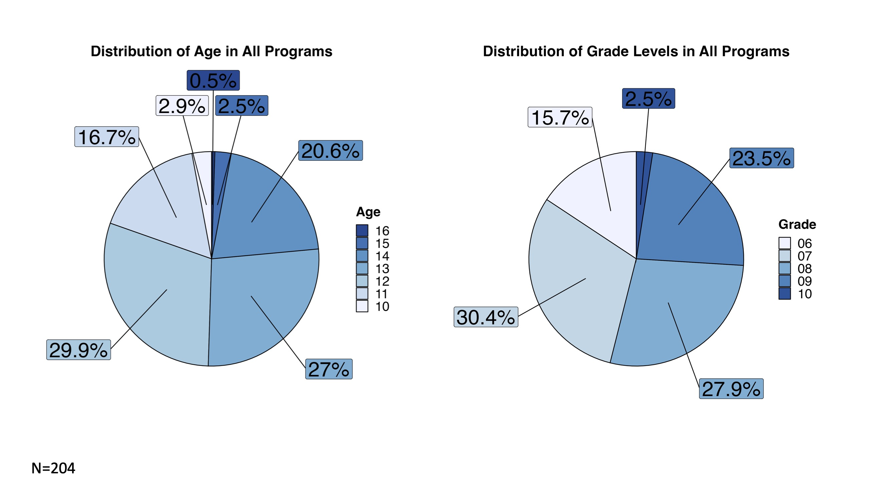
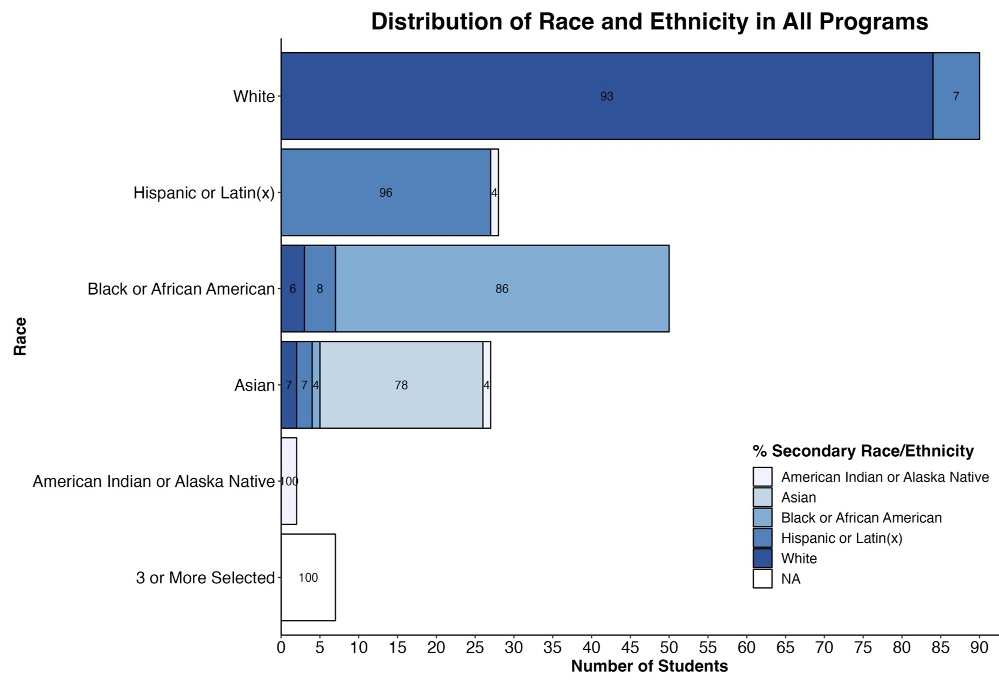
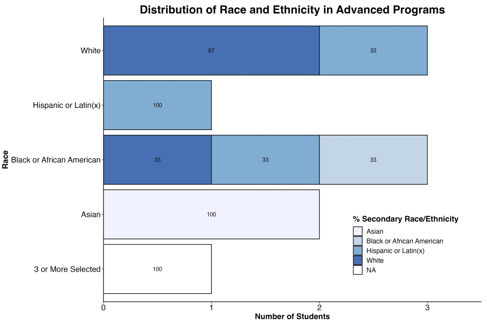

```{r setup, include=FALSE}
knitr::opts_chunk$set(echo = TRUE)
library(tidyverse)
library(tidytext)
library(dplyr)
library(readr)
library(tidyr)
library(writexl)
library(readxl)
library(textdata)
library(ggplot2)
library(scales)
library(ggrepel)
```

# Summary

The Goldberg Gator Engineering Explorers (GGEE) Summer Program was designed to provide middle school students with an authentic experience in programming, engineering design, and computational thinking. The 2023 Summer Program successfully engaged 319 students across 8 school districts. Students developed computational thinking skills through design-based challenges using micro:bit micro-controllers. 

Schools and Districts partnered with the GGEE program to host programs and sponsor teachers and materials for the programs at their schools. There were 20 local teachers that lead summer programs in their area. Twenty undergraduate engineering students from the University of Florida and neighboring colleges and universities supported teacher leaders and served as mentors for students in the program. Both teachers and undergraduate mentors were trained in program activities to upskill their abilities in programming, computational thinking, engineering desgin, and teaching practices. Two grant staff coordinated and ran the programs. 

----DATA 

Demographics
How students enjoyed the program
Growth from beginning to end

Follow up after-school programs in 5 districts for 12 sessions with around 200 students participating in the program. 

Program costs per student 

**Last year summary**
*Students reported they felt challenged during the program but were rewarded when their code or design worked. They also mentioned the importance of collaboration with peers to solve engineering problems, and they enjoyed the mentorship of the college students working with the program. The longitudinal effects of the summer program on grades in math and science and students' enrollment in higher-level courses will be tracked by the research study for the program. All districts provided in-kind donations to the camp, and many school districts have plans to host or expand the programs for next year. Some schools have asked about follow-up programming, including afterschool programming to continue student engagement. The cost per student for the program was $996, including all costs for program development (three months), camp costs (two months), and post-assessment of the program. The cost per student for future camps should be less owing to development costs built into the program's first year.*


# Introduction

## Background

The Goldberg Gator Engineering Explorers (GGEE) Summer Program was initiated by a generous donor, Arnold Goldberg, to the University of Florida Foundation. He envisioned a free summer program for underrepresented minority middle school students. The program would allow students and teachers to experience computer science and have opportunities to learn to not only program but build skills in computational thinking, problem solving, and engineering design. The vision was brought to life by the Engaging Quality Instruction through Professional Development (EQuIPD) grant at the University of Florida. Their team worked with schools, districts, and teachers across Florida to host these programs.

The GGEE Program was designed to introduce middle school-aged students to programming and computer science. The program begins with students learning the base elements of coding through small activities that engage them in applying concepts such as strings, conditional statements, loops, and variables. They use these concepts and the micro:bit to develop a simple game and to also collect and analyze light intensity data to study the relationship of light intensity and distance. The program then has students working on two scaling design challenges with partners and teams. The first is a creative engineering design challenge where they create a micro:bit pet for a partner. Then second is a technical design challenge where teams create a solution to a local problem - traffic lights for emergency service vehicles, environmental sensors for a farmer, and an indicator for new drivers. 

An Advanced Program was developed and piloted during the second year of the GGEE programs to allow returning students to continue to participate in the GGEE programs. The program was designed to introduce students to the basic concepts of Artificial Intelligence with a focus in Machine Learning. The Advanced Program session designed to be held over 4 full-days where students began with basic ideas of artificial intelligence and machine learning and are the scaffolded to developing basic and more complex machine learning models that are trained from text, images, and even gestures. This program was open to students who previously attended the GGEE program in 2022. 

## Purpose of the Report

The purpose of this report is to offer a comprehensive overview of the 2023 Goldberg Gator Engineering Explorer Summer Programs. Through this report, we aim to provide readers with insights into the entire lifecycle of our summer programs, starting from the preparations leading up to the program's launch, the activities and experiences that transpired throughout the summer, and essential information pertaining to post-program activities. Furthermore, this report will offer valuable suggestions and recommendations for improving and enhancing the quality and effectiveness of our future summer programs, setting the stage for continued growth and success in the years to come.

# Preparation

In preparation for the GGEE Summer Programs, the EQuIPD team actively engaged in district recruitment, student enrollment, and the meticulous preparation of essential research and compliance documentation.

## Research and Youth Compliance 

### Research

A new study was filed with the University of Florida's Institutional Review Board. The study included updates from the 2022 programs. Modifications to any parent and teacher consent documents, survey questions, and survey tools, and interview protocols were documented and reviewed to ensure the research study was done ethically and appropriately with K-12 student participants. 

### Youth Compliance

The GGEE Summer Program was registered with the University of Florida's Youth Compliance department. Youth compliance requires collecting student information, parent/guardian emergency contact information, as well as information on adults working with K-12 students during the programs.

All personnel hired through the University of Florida were required to undergo a level-2 background screening along with fingerprinting to be compliant to work with minors as guided by the Jessica Lundsford Act. They also complete youth compliance training from the university to ensure they understood their role and procedures to keep themselves and students safe during the summer programs. Teachers from their local schools and districts were not required to undergo background screening from UF as they have already done so with their districts. Their information was recorded and they were added as personnel for the programs. 

## Training

School district teachers and undergraduate student mentors participated in training sessions held remotely over Zoom. Sessions were held for 2 hours once a week over the course of five weeks. Program teacher leaders attended the sessions live. During those sessions teachers completed the activities from a learner perspective so they understood how to program the activity as well as an idea of how to facilitate the activity. Teacher leads had the opportunity to ask questions regarding logistics and content during the training time. 

The undergraduate mentors participated in training in a hybrid series that took place over three days. The mentors met with the facilitator for 2 hours on Tuesday and Thursday and were expected to work on their own for 2 hours on Wednesday. The facilitator review the requirements and expectations of being a program lead and reveiwed the rules for youth compliance in addition to working through the program activities with the student mentors and asnwering any questions regarding content or logistics. 


## School District Recruitment

**October 2022**

Emails were sent to schools and districts to invite them to participate in the 2023 Goldberg Gator Engineering Explorer Programs. Correspondence was sent to schools that participated in the 2022 pilot programs in addition to all of the school district leaders in Career and Technical Education across Florida. The email provided an overview of the program and it's pilot run in 2022. It also contained a survey for schools or districts to sign up to show their interest and to learn more about the program in an upcoming information session. These emails were distributed multiple times up until the information session. 

The information session was held on October, 13th, 2022 and had 11 registrants from Broward, Hillsborough, Lake, Manatee, Miami-Dade, Palm Beach, Santa Rosa, and St. Lucie counties. Orange, Pinellas, and Sarasota counties were also interested in the GGEE Programs and had either participated in the pilot programs or were participating in another EQuIPD grant program and wanted to host a summer program. 

**November - December 2022**

The GGEE team continued to communicate and build relationships with districts and teacher partners across Florida. Many conversations at this stage were discussing funding, technology needs, and personnel needs. Districts and schools worked to identify teachers for the programs. Districts were also applying and ear-marking funding to use for the summer program at the end of the year.

This year, we took an approach to share the costs of the summer programs with schools and districts to instill ownership in the program and begin the process of schools and districts running these programs on their own with guidance and training from GGEE. 

**January - March 2023**

January through April were filled with continued discussions with district, school, and city leaders. During these months, dates were finalized and any final locations were added. Once dates, program formats and locations were finalized, flyers were created for each program location and a registration survey was developed for the program. Funding was also secured by school districts for majority of the program sessions and a few locations required support from the GGEE program, Table 1. 

During this time, we worked with an additional UF foundation donors from Brevard County, Bud and Kim Deffebach, to bring a Goldberg Gator Engineering Explorer summer program to Stone Magnet Middle School in Brevard County. We also worked with the Youth Empowerment Program at the City of Riviera Beach to sponsor and host a summer program session in their STEM lab located at the public library. 

```{r Program_Fund, echo=FALSE}

library(readxl)
library(knitr)

GGEE_23_School_Districts_fund <- read_excel("Data/GGEE_23_School Districts_table.xlsx", sheet =2)

knitr::kable(GGEE_23_School_Districts_fund, caption = "2023 Goldberg Gator Engineering Summer Program location funding sources. ", "simple")

```

**April - May 2023**

Teachers were hired through UF for programs that were donor sponsored, city sponsors, or required funding assistance for their teachers. Final details to programs, technology disbursement, and training were all occurring during this time. 

By the end of scheduling, there were 20 teachers participating in the summer programs to lead sessions. 

Student participant and Undergraduate Mentor recruitment also occurred during this time and is further detailed in the following sections.

## Undergraduate Mentor Recruiment 

From April to May, the EQuIPD program recruited, interviewed and onboarded 20 undergraduate students from UF and other colleges and universities across the state. Flyers were shared with engineering student groups such as National Society of Black Engineers, Society of Hispanic Professional Engineers, Society of Asian Engineers, and Society of Women Engineers. Dr. Ruzycki and other EQuIPD students shared the opportunities in their classes. 

To minimize travel costs, we recruited students that were local to the areas hosting summer programs. Many students went home for the summer or were able to stay with a relative for the duration of the program.

By the end of the recruitment and onboarding process, there were 20 undergraduate students employed to support the GGEE summer programs, Table 2. 

```{r Mentors, echo=FALSE}

library(readxl)
library(knitr)

Undergrad_Hires <- read_excel("Data/Undergrad_Hires.xlsx")

knitr::kable(Undergrad_Hires, caption = "Goldberg Gator Engineering Explorers undergraduate student mentor recruitment colleges and universities.", "simple", align = 'lcl')

```


## Student Participant Recruitment

The GGEE summer programs are targeted to middle school students. We invited students that are rising sixth graders to rising ninth graders to participate. For the advanced programs, we extended the grade level to include rising tenth grade students to avoid excluding students that participated as rising ninth graders last year. Students range from 10-16 years of age in the programs.

The GGEE program provided schools and districts with flyers detailing the summer program dates and locations. The flyer contained a link to a registration survey where parents provided information for their child meeting the requirements for the University of Florida's youth compliance standards. 

Summer program locations were in charge of recruitment for their programs. Many teachers and schools shared the flyers with their students and schools to invite students that attend their school. Other districts shared their flyers on their social media pages or sent announcements using parent communication portals and invited students from across the district as long as they were enrolled in a school in their district. 

# Scheduling

## 2022 vs. 2023

The program was piloted during the Summer of 2022 with eight sessions and six school districts. The program served just over 100 hundred students in Alachua, Collier, Escambia, Palm Beach, Orange, and Sarasota counties. 

Through oartnerships with schools, distrcits, and cities, 


<center>

</center>

```{r Programs, echo=FALSE}

library(readxl)
library(knitr)
GGEE_23_School_Districts_table <- read_excel("Data/GGEE_23_School Districts_table.xlsx")

knitr::kable(GGEE_23_School_Districts_table, caption = "2023 Goldberg Gator Engineering Summer Program Locations, Programs, and Formats.", "simple")

```

## Program Calendar

*Provide an overview of the program's calendar, including the duration of the program, daily schedules, and key activities.*

There were X many programs in each district


<center>
{ width=100%}
</center>

# Program Layouts

The GGEE summer programs were designed to provide options that best fit with school district's summer schedules and existing summer programs. To better accommodate and support our programs, we structured them to run on 4-day schedules for either 4 full-days for 7-8 hour days or 8 half-days for 4-5 hour days. When working with schools we founds that some ran for an entire day, some were open for half of a day, and almost all locations were closed on Fridays. 

## Introductory Programs

The Introductory Program design allowed students with varying skill levels to participate. The program can be run in 4-day, full-day or 8-day, half-day programs. A roadmap, Figure ^, was developed to walk through the program by day. The goals for the first day of the program were to introduce the team, goals for the program, collaborative learning strategies, and Micro:bit programming basics using no-code and low-code activities. The program then introduced students to their first design-based activity where they were challenged with designing a Micro:bit Pet for their partner using the Stanford design cycle: Empathize, Define, Ideate, Prototype, Test. While designing the Pet, students had to learn to wire and program external sensors and motors to the Micro:bit to create additional features for pets. The remainder of the program focused on a technical design challenge where student groups worked together in a project team to design a solution for one of three challenges: temperature regulation in a greenhouse, an acceleration indicator for a new driver, and a remotely activated stoplight for first responders. Together, they stepped through the design cycle to develop solutions to these challenges like many engineers and scientists. They also developed teamwork and program management skills during the technical design challenge. 

<center>
{ width=70%}
</center>

## Advanced Programs

The Advanced Program was formatted as 4 day program in all the pilot schools, Figure ^. Students were first introduced to the basic concepts of artificial intelligence and then machine learning. The day was concluded with an introduction to programming in [Scratch](https://scratch.mit.edu/) to prepare for the following day when students were introduced to Image-based and Test-based machine learning models from [Machine Learning for Kids](https://machinelearningforkids.co.uk/). Students develop and train a image-based machine learning model that analyzes the color characteristics of different types of Pokémon. They then trained a text-based machine learning model to design a smart classroom that had electronic devices that power on or off using a variety of written commands. On the third day, students use their micro:bit programming skills from last summer program to program a micro:bit to identify different types of gestures. During this activity, students built their own sets of training data using the micro:bits. Students program gestures together as a class and a number of gestures on their own. The machine learning models were trained using a decision tree constructed in Python and hosted in a Juypter Notebook on [NanoHub](https://nanohub.org/). The model was loaded onto the micro:bit giving it the ability to identify gestures based on the training data provided. To round out the program, students were introduced to Neural Networks. The activity walked them through the various types of machine learning models from decision trees to more complex neural networks. Students learned about the multiple layers in a neural network and the processes that each of those layer serve. The following activity had students develop and train a neural network to identify images of numbers. Students manipulated the number of nodes and studied the effect on the outcame and weights in identifying each number. This activity concluded the program. 

<center>
{ width=70%}
</center>


# Student Enrollment & Demographics

## Enrollment Statistics
*Present enrollment data, including the number of students who initially registered, and any changes over the course of the program.*

Programs were able to host up to 25 students in each of their program sessions. Registrations were closed and students were placed on wait lists in the case of cancellations by student parents. 
Programs had on average X number of students enroll. Wait lists ranged from 5 - 80 students in some districts.

Bar Graph Comparison - 
Total Number of Registered Students - stacked bar graph - registered vs waitlist

**GRAPH by Session - stacked graph - regsitered vs waitlist**

Need for more programs in Santa Rosa County District Schools


## Attendance Records
*Share attendance records to illustrate the level of student engagement and participation throughout the program.*

Actual attendance with the programs were less than initial registrations. Students became ill, were unable to attend the first days of the program or parents made new plans for their families. 

<center>
{ width=55%}
</center>

<center>

</center>


## Student Demographics

Demographics were collected from students that participated in the resaerch study. There were a total of 204 students that participated in the GGEE Summer programs. **add amounts from intro and advanced**

### Age
*Include demographic information such as age, gender, ethnicity, and socioeconomic background of the participating students.*

<center>
{ width=45%}
</center>


<center>
{ width=85%}
</center>


### Gender

<center>
{ width=50%}
</center>


<center>

</center>


### Race and Ethnicity

- Students that chose 3 or more race and ethnicity were grouped together
- Count of students by race or ethnicity in each course 
- Many students selected multiple races or ethnicity, primary race with secondary ethniticty was listed
- Broken down into percentage of secondary race or ethnicity

<center>
{ width=80%}
</center>


<center>
{ width=80%}
</center>

<center>
{ width=80%}
</center>


# Research

## Summary of Pre-Survey Survey Results
Summarize the responses from the pre-program survey, highlighting key findings and insights.

##  Survey Responses

## Analysis of Ongoing Survey Data (if conducted during the program)
If you conducted surveys during the program, analyze the responses and share any noteworthy trends or changes over time.

## Student Interviews

### Highlights from Student Interviews
Share significant insights and quotes gathered from student interviews, emphasizing their experiences and perspectives.

## End of Program Survey Responses

### Summary of Post-Program Survey Results
Present the results of the post-program survey, emphasizing any changes in student responses compared to the pre-program survey.


# Program Outcomes

## Assessment of Program Objectives and Goals
Evaluate whether the program met its objectives and goals as outlined in the introduction.

# Challenges and Lessons Learned

## Identification of Challenges Faced
Discuss any challenges encountered during the program's implementation.

## Lessons Learned & Adaptations Made
Share lessons learned from the program's challenges and any adjustments or improvements made as a result.

# Recommendations

## Suggestions for Program Improvement
*Provide recommendations for improving the program in future iterations, based on the insights gained.*

- Updating compliance forms with more clear langaue for parent and the research study
- Make submitting paperwork a part of the registration process. Did this with the 2023-2024 After-School programs and it has made everything so much easier to process and collect rather than a 2-step process
- Creating contract-like documents to denote needs, requirments, and expectations from the schools and what is provided from the GGEE program at UF
- Starting Recruitment in November
- ensuring districts cover technology to continue to use in after-school programs or integrate into classroom projects
- revise research study to expand to get more teacher and UF undergraduate mentor insight in the program 


## Future Directions
*Suggest potential directions for the program's growth or expansion.*

### After-school Programs

overview of programs 


# Conclusion

## Recap of Program's Successes
Summarize the program's achievements and positive outcomes.

## Reiteration of Impact on Students
Emphasize how the program benefited the participating students and the broader school community.

# Appendices

Include any supplementary materials, such as additional data charts and graphs, the complete survey questions, and interview transcripts.

Please adapt this template to your specific program and add more details and content as needed to create a comprehensive final report for your middle school summer program.


