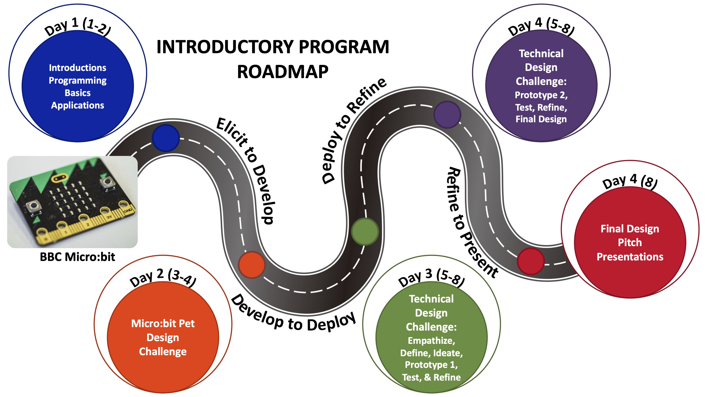

```{r setup, include=FALSE}
knitr::opts_chunk$set(echo = TRUE)
library(tidyverse)
library(tidytext)
library(dplyr)
library(readr)
library(tidyr)
library(writexl)
library(readxl)
library(textdata)
library(ggplot2)
library(scales)
library(ggrepel)
```

# Summary

The Goldberg Gator Engineering Explorers (GGEE) Summer Program was designed to provide middle school students with an authentic experience in programming, engineering design, and computational thinking. The 2023 Summer Program successfully engaged 319 students across 8 school districts. Students developed computational thinking skills through design-based challenges using micro:bit micro-controllers. 

Schools and Districts partnered with the GGEE program to host programs and sponsor teachers and materials for the programs at their schools. There were 20 local teachers that lead summer programs in their area. Twenty undergraduate engineering students from the University of Florida and neighboring colleges and universities supported teacher leaders and served as mentors for students in the program. Both teachers and undergraduate mentors were trained in program activities to upskill their abilities in programming, computational thinking, engineering desgin, and teaching practices. Two grant staff coordinated and ran the programs. 

----DATA 

Demographics
How students enjoyed the program
Growth from beginning to end

Follow up after-school programs in 5 districts for 12 sessions with around 200 students participating in the program. 

Program costs per student 

**Last year summary**
*Students reported they felt challenged during the program but were rewarded when their code or design worked. They also mentioned the importance of collaboration with peers to solve engineering problems, and they enjoyed the mentorship of the college students working with the program. The longitudinal effects of the summer program on grades in math and science and students' enrollment in higher-level courses will be tracked by the research study for the program. All districts provided in-kind donations to the camp, and many school districts have plans to host or expand the programs for next year. Some schools have asked about follow-up programming, including afterschool programming to continue student engagement. The cost per student for the program was $996, including all costs for program development (three months), camp costs (two months), and post-assessment of the program. The cost per student for future camps should be less owing to development costs built into the program's first year.*


# Introduction

## Background

The Goldberg Gator Engineering Explorers Summer Program was initiated by a generous donor, Arnold Goldberg, to the University of Florida Foundation. He envisioned a free summer program for underrepresented minority middle school students. The program would allow students and teachers to experience computer science and have opportunities to learn to not only program but build skills in computational thinking, problem solving, and engineering design. The vision was brought to life by the Engaging Quality Instruction through Professional Development (EQuIPD) grant at the University of Florida. Their team worked with schools, districts, and teachers across Florida to host these programs.

The Goldberg Gator Engineering Explorers Program was designed to introduce middle school-aged students to programming and computer science. The program begins with students learning the base elements of coding through small activities that engage them in applying concepts such as strings, conditional statements, loops, and variables. They use these concepts and the micro:bit to develop a simple game and to also collect and analyze light intensity data to study the relationship of light intensity and distance. The program then has students working on two scaling design challenges with partners and teams. The first is a creative engineering design challenge where they create a micro:bit pet for a partner. Then second is a technical design challenge where teams create a solution to a local problem - traffic lights for emergency service vehicles, environmental sensors for a farmer, and an indicator for new drivers. 

Entering the second year of GGEE, an Advanced Program was developed and piloted to allow returning students to continue to participate in the GGEE programs. The Advanced Program was designed to introduce students to the basic concepts of Artificial Intelligence with a focus in Machine Learning. The Advanced program session was held over 4 full-days and were open to students who previously attended the GGEE program in 2022. 

## Purpose of the Report

*Explain the purpose of this final report and what the reader can expect to find within it.*
This funding report provides an overview of the 2023 Goldberg Gator Engineering Explorer Summer Programs.


# District Recruitment

## Recruitment Strategies

*Detail the strategies used to recruit students for the program. Discuss any partnerships or collaborations that helped with recruitment efforts.*

School recruitment for the 2023 GGEE Summer Programs began in November of 2022. Flyers were shared via email to school administration 


## Participant Selection Criteria

*Explain the criteria used to select participants for the program. This could include grade level, academic standing, or other factors.*

School Recruitment


# Summer Programs

## 2022 vs. 2023

The program was piloted during the Summer of 2022 with eight sessions and six school districts. The program served just over 100 hundred students. The pilot summer program paved the way for a pilot year of virtual after-school programs during the 2022-2023 school year. Student joined the sessions remotely from home. The 2023 summer program #################################


<center>

</center>

<center>
```{r Programs, echo=FALSE}

library(readxl)
library(knitr)
GGEE_23_School_Districts_table <- read_excel("Data/GGEE_23_School Districts_table.xlsx")

knitr::kable(GGEE_23_School_Districts_table, caption = "Table 1: 2023 Goldberg Gator Engineering Summer Program Locations, Programs, and Formats.", "simple")

```
</center>


## Program Calendar
*Provide an overview of the program's calendar, including the duration of the program, daily schedules, and key activities.*

There were X many programs in each district


<center>
{ width=90%}
</center>

## Program Layouts

## Introductory Programs

<center>
{ width=90%}
</center>

## Advanced Programs

### 4-Day Programs


### 8-Day Programs


# Youth Compliance 

## Waivers and Research Consent    

## Storage of Student Information

## Institutional Review Board


# Program Numbers

## Enrollment Statistics
*Present enrollment data, including the number of students who initially registered, and any changes over the course of the program.*

Programs were able to host up to 25 students in each of their program sessions. Registrations were closed and students were placed on wait lists in the case of cancellations by student parents. 
Programs had on average X number of students enroll. Wait lists ranged from 5 - 80 students in some districts.

Bar Graph Comparison - 
Total Number of Registered Students - stacked bar graph - registered vs waitlist

**GRAPH by Session - stacked graph - regsitered vs waitlist**

Need for more programs in Santa Rosa County District Schools


## Attendance Records
*Share attendance records to illustrate the level of student engagement and participation throughout the program.*

Actual attendance with the programs were less than initial registrations. Students became ill, were unable to attend the first days of the program or parents made new plans for their families. 

**GRAPH Attendance Numbers by School**

````{r District, echo=FALSE, }
GGEE_23_Camps <- read_excel("Data/GGEE_23_Camps.xlsx", sheet = 1)
#View(GGEE_23_Camps)
GGEE_23_Camps_Intro <- read_excel("Data/GGEE_23_Camps.xlsx", sheet = 2)
GGEE_23_Camps_Adv <- read_excel("Data/GGEE_23_Camps.xlsx", sheet = 3)
  
  
All_Students <- sum(GGEE_23_Camps$n)
Intro_Students <- sum(GGEE_23_Camps_Intro$n)
Adv_Students <- sum(GGEE_23_Camps_Adv$n)

#District All
Camps_all <- read_excel("Data/GGEE_23_Camps.xlsx", sheet = 4)

df_all <- Camps_all%>% 
  mutate(csum = rev(cumsum(rev(n))), 
         pos = n/2 + lead(csum, 1),
         pos = if_else(is.na(pos), n/2, pos))


District_all <- ggplot(Camps_all, aes(x="", y=n, fill=Dist)) +
  geom_bar(stat="identity", width=1, color="black") +
  coord_polar("y", start=0)+
  theme_void()+
  scale_fill_brewer(guide = guide_legend(reverse = FALSE),palette = "Blues")+
  ggtitle("Students Per District for All Programs")+
  theme(plot.title = element_text(hjust = 0.5, vjust = .5))+
  geom_label_repel(data = df_all,
                   aes(y = pos, label = paste0(round(n/All_Students*100, digits=1), "%")),
                   size = 4.5, nudge_x = 1, show.legend = FALSE)+
  theme(legend.position = c(1.15, .5))


Camps_intro <- read_excel("Data/GGEE_23_Camps.xlsx", sheet = 5)

df_intro <- Camps_intro%>% 
  mutate(csum = rev(cumsum(rev(n))), 
         pos = n/2 + lead(csum, 1),
         pos = if_else(is.na(pos), n/2, pos))


District_intro <- ggplot(Camps_intro, aes(x="", y=n, fill=Dist)) +
  geom_bar(stat="identity", width=1, color="black") +
  coord_polar("y", start=0)+
  theme_void()+
  scale_fill_brewer(guide = guide_legend(reverse = FALSE),palette = "Blues")+
  ggtitle("Students Per District in Introductory Programs")+
  theme(plot.title = element_text(hjust = 0.5, vjust = .5))+
  geom_label_repel(data = df_intro,
                   aes(y = pos, label = paste0(round(n/Intro_Students*100, digits=1), "%")),
                   size = 4.5, nudge_x = 1, show.legend = FALSE)+
  theme(legend.position = c(1.15, .5))


Camps_adv <- read_excel("Data/GGEE_23_Camps.xlsx", sheet = 6)

df_adv <- Camps_adv%>% 
  mutate(csum = rev(cumsum(rev(n))), 
         pos = n/2 + lead(csum, 1),
         pos = if_else(is.na(pos), n/2, pos))


District_Adv <- ggplot(Camps_adv, aes(x="", y=n, fill=Dist)) +
  geom_bar(stat="identity", width=1, color="black") +
  coord_polar("y", start=0)+
  theme_void()+
  scale_fill_brewer(guide = guide_legend(reverse = FALSE),palette = "Blues")+
  ggtitle("Students Per District in Advanced Programs")+
  theme(plot.title = element_text(hjust = 0.5, vjust = .5))+
  geom_label_repel(data = df_adv,
                   aes(y = pos, label = paste0(round(n/Adv_Students*100, digits=1), "%")),
                   size = 4.5, nudge_x = 1, show.legend = FALSE)+
  theme(legend.position = c(1.15, .5))

```

<center>
````{r District_all, echo=FALSE, }
District_all
```


</center>

<center>
```{r District_in_out, echo=FALSE, fig.show = "hold", out.width = "50%"}

District_intro
District_Adv
```


</center>


# Student Demographics

## Age
*Include demographic information such as age, gender, ethnicity, and socioeconomic background of the participating students.*

Demographics were collected on students participating in the research study.


```{r Age Demo, echo=FALSE, fig.show = "hold", out.width = "50%"}
GGEE_23_Pre0 <- read_excel("Data/GGEE_23_PreSurvey.xlsx", sheet = 1)
GGEE_23_Pre <-filter(GGEE_23_Pre0, Finished == "True")

age <- select(GGEE_23_Pre, Age, Program)|>
        count(Age, Program)|>
        na.omit(age)

age_all <- select(GGEE_23_Pre, Age, Program)|>
  count(Age)|>
  na.omit(age)


age_n <- 1+6+3+6+34+60+49+39+5+1

df_age_all <- age_all%>% 
  mutate(csum = rev(cumsum(rev(n))), 
         pos = n/2 + lead(csum, 1),
         pos = if_else(is.na(pos), n/2, pos))


Demo_age_all <-ggplot(age_all, aes(x="", y=n, fill=Age)) +
  geom_bar(stat="identity", width=1, color="black") +
  coord_polar("y", start=0)+
  theme_void()+
  scale_fill_brewer(guide = guide_legend(reverse = TRUE),palette = "Blues")+
  ggtitle("Age Distribution for All Programs")+
  theme(plot.title = element_text(hjust = 0.5, vjust = .5))+
  geom_label_repel(data = df_age_all,
                   aes(y = pos, label = paste0(round(n/age_n*100, digits=1), "%")),
                   size = 4.5, nudge_x = 1, show.legend = FALSE)+
  theme(legend.position = c(1, .5))

age_intro <- filter(age, Program == "Introductory - 1st Year with GGEE")

age_intro_n <- 6+34+60+49+39+5+1

df_age_intro <- age_intro%>% 
  mutate(csum = rev(cumsum(rev(n))), 
         pos = n/2 + lead(csum, 1),
         pos = if_else(is.na(pos), n/2, pos))


Demo_age_intro <- ggplot(age_intro, aes(x="", y=n, fill=Age)) +
  geom_bar(stat="identity", width=1, color="black") +
  coord_polar("y", start=0)+
  theme_void()+
  scale_fill_brewer(guide = guide_legend(reverse = TRUE),palette = "Blues")+
  ggtitle("Age Distribution of Introductory Programs")+
  theme(plot.title = element_text(hjust = 0.5, vjust = .5))+
  geom_label_repel(data = df_age_intro,
                   aes(y = pos, label = paste0(round(n/age_intro_n*100, digits=1), "%")),
                   size = 4.5, nudge_x = 1, show.legend = FALSE)+
  theme(legend.position = c(1, .5))


age_adv <- filter(age, Program == "Advanced - 2nd Year with GGEE")

age_adv_n <- 1+6+3

df_age_adv <- age_adv%>% 
  mutate(csum = rev(cumsum(rev(n))), 
         pos = n/2 + lead(csum, 1),
         pos = if_else(is.na(pos), n/2, pos))


Demo_age_adv <- ggplot(age_adv, aes(x="", y=n, fill=Age)) +
  geom_bar(stat="identity", width=1, color="black") +
  coord_polar("y", start=0)+
  theme_void()+
  scale_fill_brewer(guide = guide_legend(reverse = TRUE),palette = "Blues")+
  ggtitle("Age Distribution of Advanced Programs")+
  theme(plot.title = element_text(hjust = 0.5, vjust = .5))+
  geom_label_repel(data = df_age_adv,
                   aes(y = pos, label = paste0(round(n/age_adv_n*100, digits=1), "%")),
                   size = 4.5, nudge_x = 1, show.legend = FALSE)+
  theme(legend.position = c(1, .5))
```


<center>
````{r Age Demo_all, echo=FALSE, }
Demo_age_all
```

*Demographics for all Goldberg Gator Engineering Explorer Summer Programs. N=-204*
</center>

<center>
```{r Age Demo_in_out, echo=FALSE, fig.show = "hold", out.width = "50%"}


Demo_age_adv
Demo_age_intro
```
</center>


## Gender

## Race and Ethnicity

## 


# Pre-Survey Responses

## Summary of Pre-Program Survey Results
Summarize the responses from the pre-program survey, highlighting key findings and insights.

# Survey Responses

## Analysis of Ongoing Survey Data (if conducted during the program)
If you conducted surveys during the program, analyze the responses and share any noteworthy trends or changes over time.

# Student Interviews

## Highlights from Student Interviews
Share significant insights and quotes gathered from student interviews, emphasizing their experiences and perspectives.

# Final Program Survey Responses

## Summary of Post-Program Survey Results
Present the results of the post-program survey, emphasizing any changes in student responses compared to the pre-program survey.

# Program Outcomes

## Assessment of Program Objectives and Goals
Evaluate whether the program met its objectives and goals as outlined in the introduction.

# Challenges and Lessons Learned

## Identification of Challenges Faced
Discuss any challenges encountered during the program's implementation.

## Lessons Learned and Adaptations Made
Share lessons learned from the program's challenges and any adjustments or improvements made as a result.

# Recommendations

## Suggestions for Program Improvement
*Provide recommendations for improving the program in future iterations, based on the insights gained.*

- Updating compliance forms with more clear langaue for parent and the research study
- Make submitting paperwork a part of the registration process. Did this with the 2023-2024 After-School programs and it has made everything so much easier to process and collect rather than a 2-step process
- Creating contract-like documents to denote needs, requirments, and expectations from the schools and what is provided from the GGEE program at UF
- Starting Recruitment in November
- ensuring districts cover technology to continue to use in after-school programs or integrate into classroom projects
- revise research study to expand to get more teacher and UF undergraduate mentor insight in the program 


## Future Directions
*Suggest potential directions for the program's growth or expansion.*

# Conclusion

## Recap of Program's Successes
Summarize the program's achievements and positive outcomes.

## Reiteration of Impact on Students
Emphasize how the program benefited the participating students and the broader school community.

# Appendices

Include any supplementary materials, such as additional data charts and graphs, the complete survey questions, and interview transcripts.

Please adapt this template to your specific program and add more details and content as needed to create a comprehensive final report for your middle school summer program.


