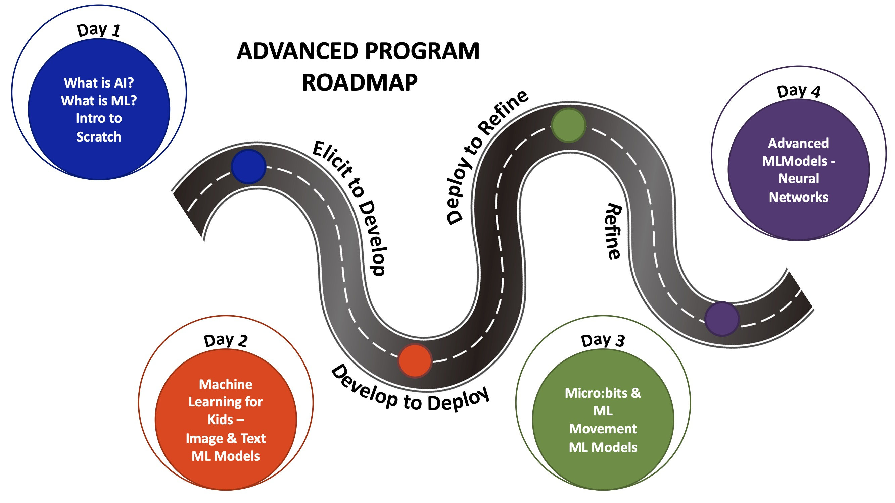
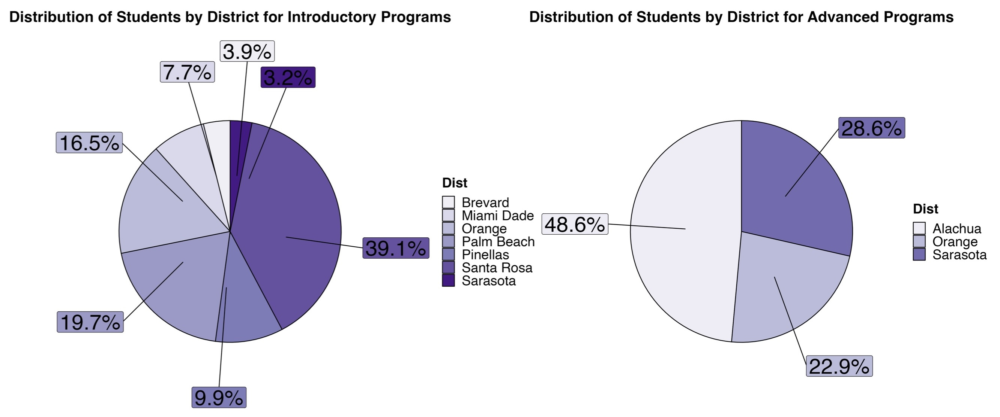
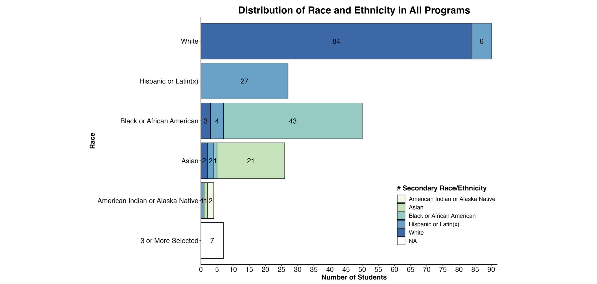
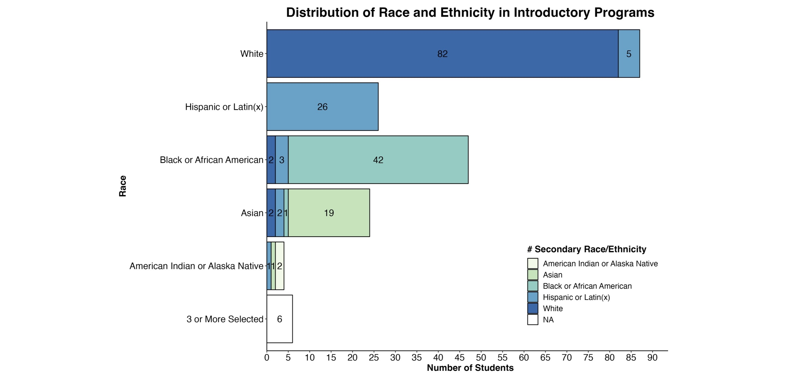

```{r setup, include=FALSE}
knitr::opts_chunk$set(echo = TRUE)
library(tidyverse)
library(tidytext)
library(dplyr)
library(readr)
library(tidyr)
library(writexl)
library(readxl)
library(textdata)
library(ggplot2)
library(scales)
library(ggrepel)
```

# Summary

The Goldberg Gator Engineering Explorers (GGEE) Summer Program was designed to provide middle school students with an immersive experience in programming, engineering design, and computational thinking. In the summer of 2023, the program achieved a resounding success, engaging 319 students across 8 Florida school districts in a total of 22 sessions. Through these sessions, students honed their computational thinking skills by taking on design-based challenges that involved the innovative use of micro:bit micro-controllers. Among these sessions, 19 were dedicated to introductory programs, where students were introduced to the fundamentals of programming, engineering design, and hands-on work with micro:bits. The GGEE program introduced an advanced track, where 3 sessions piloted middle-school level activities in artificial intelligence and machine learning. In these advanced sessions, students had the opportunity to build machine learning models and apply them to micro:bits, fostering a deep understanding of these cutting-edge technologies.

Our partnerships with schools and districts were instrumental in making these programs a reality. The commitment of 20 local teachers who led the summer programs in their respective areas was invaluable. Supported by 20 undergraduate engineering students from the University of Florida (UF) and neighboring colleges and universities, these teachers played a pivotal role in mentoring students throughout the program. To ensure their effectiveness, both teachers and undergraduate mentors underwent comprehensive training in program activities, equipping them with proficiency in programming, computational thinking, engineering design, and effective teaching practices. The program was executed seamlessly under the guidance of two dedicated grant staff members. While the final funding breakdown will be available shortly, the average estimated cost to host a single GGEE program session was approximately \$2,500, with the support of UF and around \$3,000 from our partnering schools and districts.

We are immensely grateful for the generous support from donors Arnold Goldberg and Bud and Kim Deffebach, along with contributions from school districts and city programs such as the City of Riviera Beach Youth Empowerment Programs. Furthermore, the GGEE Summer Programs received funding from the State of Florida Department of Education (291-1231C-2C001), which was instrumental in supporting student travel, program duration, and technology provision.

The demand for our programs was evident, with over 700 students expressing interest and registering. However, to ensure a quality experience, we limited each session to 25 students, leading to substantial wait lists with 5-10+ students. In total, over 300 students actively participated in the program, with slightly over 200 students engaging in the research component. The enthusiasm among students was palpable as they embarked on their journey with the GGEE Summer Programs. We are currently in the process of analyzing the student survey responses and interviews, seeking to provide a comprehensive study on the impact of GGEE Summer Program participation on students' motivation and their identities as aspiring engineers and scientists. This invaluable insight will continue to guide our program's evolution and the positive influence it imparts on the students we serve.

# Introduction

## Background

The Goldberg Gator Engineering Explorers (GGEE) Summer Program was initiated by a generous donor, Arnold Goldberg, to the University of Florida Foundation. He envisioned a free summer program for underrepresented minority middle school students. The program would allow students and teachers to experience computer science and have opportunities to learn to not only program but build skills in computational thinking, problem solving, and engineering design. The vision was brought to life by the Engaging Quality Instruction through Professional Development (EQuIPD) grant at the University of Florida. Their team worked with schools, districts, and teachers across Florida to host these programs.

The GGEE Program was designed to introduce middle school-aged students to programming and computer science. The program begins with students learning the base elements of coding through small activities that engage them in applying concepts such as strings, conditional statements, loops, and variables. They use these concepts and the micro:bit to develop a simple game and to also collect and analyze light intensity data to study the relationship of light intensity and distance. The program then has students working on two scaling design challenges with partners and teams. The first is a creative engineering design challenge where they create a micro:bit pet for a partner. Then second is a technical design challenge where teams create a solution to a local problem - traffic lights for emergency service vehicles, environmental sensors for a farmer, and an indicator for new drivers. 

An Advanced Program was developed and piloted during the second year of the GGEE programs to allow returning students to continue to participate in the GGEE programs. The program was designed to introduce students to the basic concepts of Artificial Intelligence, focusing on Machine Learning. The Advanced Program session was intended to be held over four full-days where students began with basic ideas of artificial intelligence and machine learning and are the scaffolded to developing basic and more complex machine learning models that are trained from text, images, and even gestures. This program was open to students who previously attended the GGEE program in 2022. 

## Purpose of the Report

This report offers a comprehensive overview of the 2023 Goldberg Gator Engineering Explorer Summer Programs. Through this report, we aim to provide readers with insights into the entire lifecycle of our summer programs, starting from the preparations leading up to the program's launch, the activities and experiences that transpired throughout the summer, and essential information pertaining to post-program activities. Furthermore, this report will offer valuable suggestions and recommendations for improving and enhancing the quality and effectiveness of our future summer programs, setting the stage for continued growth and success in the years to come.

# Preparation

In preparation for the GGEE Summer Programs, the EQuIPD team actively engaged in district recruitment, student enrollment, and the meticulous preparation of essential research and compliance documentation.

## Funding

Funding for the Goldberg Gator Engineering Explorer Summer Programs came from multiple sources this year, in addition to the donation from Arnold Goldberg to the University of Florida's Herbert Wertheim College of Engineering. 

*State of Florida Department of Education*

The State of Florida Department of Education provided \$199,000 (291-1231C-2C001) to support the Goldberg Gator Engineering Explorer Summer Programs alongside providing training and materials for teachers around artificial intelligence. These funds supported staff time and effort, program travel, technology, and consumable materials.

*Bud and Kim Deffebach UF Foundation*

We partnered with Bud and Kim Deffebach to host a GGEE summer and after-school program for students in Brevard County at Stone Magnet Middle School. Their gift of \$24,000 provided funding for the teacher to train and lead the summer and after-school programs, consumable materials, technology, and meals for the students and staff that participated in the summer program.

*City of Riviera Beach - Youth Empowerment Programs* 

The EQuIPD grant worked with the City of Riviera Beach to host a session of the GGEE program over the summer. The city provided meals for the students and a learning lab space for their Youth Empowerment Programs within their public library. A \$5,500 contract was developed between UF and the city for the city to provide funding for a teacher, technology, and consumable learning materials. The GGEE program provided funding for the student mentors supporting the program. 

*Schools and Districts*

Many of the schools and districts we collaborated with to host GGEE summer programs were able to allocated funds from the end of the year to support their teachers through training and leading sessions, technology such as micro:bits and STEM kits for the teachers to keep for their own classrooms and after-school programs, and consumable materials such as paper, pencils, pens, markers, tape, and glue. The GGEE program provided funding for student mentors time and any travel costs. Many school districts provided breakfast and lunch for students participating in the program as part of the already existing summer lunch programs. 
The estimated costs for schools were around \$4,000 for 4-day programs and around \$6,000 for 8-day half-day programs.

Table 1 displays the funding sources for each of the GGEE program sessions. A more concise breakdown of funds will be provided in an additional report.

```{r Program_Fund, echo=FALSE}

library(readxl)
library(knitr)

GGEE_23_School_Districts_fund <- read_excel("Data/GGEE_23_School Districts_table.xlsx", sheet =2)

knitr::kable(GGEE_23_School_Districts_fund, caption = "2023 Goldberg Gator Engineering Summer Program location funding sources. ", "simple", align = 'llc')

```

## Research and Youth Compliance 

### Research
A new study was filed with the University of Florida's Institutional Review Board. The study included updates from the 2022 programs. Modifications to any parent and teacher consent documents, survey questions, survey tools, and interview protocols were documented and reviewed to ensure the research study was done ethically and appropriately with K-12 student participants. 

### Youth Compliance

The GGEE Summer Program was registered with the University of Florida's Youth Compliance Department. Youth compliance requires collecting student information, parent/guardian emergency contact information, and information on adults working with K-12 students during the programs.

All personnel hired through the University of Florida must undergo a level-2 background screening and fingerprinting to comply with the Jessica Lundsford Act to work with minors. They also completed youth compliance training from the university to ensure they understood their role and procedures to keep themselves and their students safe during the summer programs. Teachers from their local schools and districts were not required to undergo background screening from UF as they have already done so with their districts. Their information was recorded and they were added as personnel for the programs. 

## Training

School district teachers and undergraduate student mentors participated in training sessions held remotely over Zoom. Sessions were held for 2 hours once a week over five weeks. Program teacher leaders attended the sessions live. During those sessions, teachers completed the activities from a learner perspective so they understood how to program the activity as well as an idea of how to facilitate the activity. Teacher leads had the opportunity to ask questions regarding logistics and content during the training time. 

The undergraduate mentors participated in training in a hybrid series over three days. The mentors met with the facilitator for 2 hours on Tuesday and Thursday and were expected to work independently for 2 hours on Wednesday. The facilitator reviewed the requirements and expectations of being a program lead and reviewed the rules for youth compliance in addition to working through the program activities with the student mentors and answering any questions regarding content or logistics. 

## School District Recruitment

*October 2022*

Emails were sent to schools and districts to invite them to participate in the 2023 Goldberg Gator Engineering Explorer Programs. Correspondence was sent to schools that participated in the 2022 pilot programs and all school district leaders in Career and Technical Education across Florida. The email provided an overview of the program and pilot run in 2022. It also contained a survey for schools or districts to sign up to show their interest and to learn more about the program in an upcoming information session. These emails were distributed multiple times up until the information session. 

The information session was held on October 13th, 2022, with 11 registrants from Broward, Hillsborough, Lake, Manatee, Miami-Dade, Palm Beach, Santa Rosa, and St. Lucie counties. Orange, Pinellas, and Sarasota counties were also interested in the GGEE Programs. They had either participated in the pilot programs or were participating in another EQuIPD grant program and wanted to host a summer program. 

*November - December 2022*

The GGEE team continued to communicate and build relationships with districts and teacher partners across Florida. Many conversations at this stage discussed funding, technology, and personnel needs. Districts and schools worked to identify teachers for the programs. Districts were also applying and ear-marking funding to use for the summer program at the end of the year.

This year, we took an approach to share the costs of the summer programs with schools and districts to instill ownership in the program and begin the process of schools and districts running these programs on their own with guidance and training from GGEE.  

*January - March 2023*

January through April were filled with continued discussions with district, school, and city leaders. During these months, dates were finalized, and any final locations were added. Once dates, program formats, and locations were confirmed, flyers were created for each program location, and a registration survey was developed for the program. 

*April - May 2023*

Teachers were hired through UF for programs that were donor-sponsored, city-sponsored, or required funding assistance for their teachers. Final details of programs, technology disbursement, and training occurred during this time. By the end of scheduling, 20 teachers were participating in the summer programs to lead sessions. 

Student participant and Undergraduate Mentor recruitment also occurred during this time and is further detailed in the following sections.

## Undergraduate Mentor Recruiment 

From April to May, the EQuIPD program recruited, interviewed, and on-boarded 20 undergraduate students from UF and other colleges and universities across the state, Table 2. 

```{r Mentors, echo=FALSE}

library(readxl)
library(knitr)

Undergrad_Hires <- read_excel("Data/Undergrad_Hires.xlsx")

knitr::kable(Undergrad_Hires, caption = "Goldberg Gator Engineering Explorers undergraduate student mentor recruitment colleges and universities.", "simple", align = 'lcl')

```

Flyers were shared with engineering student groups such as the National Society of Black Engineers, Society of Hispanic Professional Engineers, Society of Asian Engineers, and Society of Women Engineers to recruit student mentors to support the summer programs. Dr. Ruzycki and other EQuIPD students shared the opportunities in their classes. 

To minimize travel costs, we recruited local students to the areas hosting summer programs. Since many undergraduate students return home for the summer, it was easy for them to attend and support their local GGEE program. 

## Student Participant Recruitment

The GGEE summer programs are targeted to middle school students. We invited students from rising sixth to rising ninth graders to participate. For the advanced programs, we extended the grade level to include rising tenth-grade students to avoid excluding students who participated as rising ninth-graders last year. Students range from 10-16 years of age in the programs.

The GGEE program provided school and district flyers detailing the summer program dates and locations. The flyer contained a link to a registration survey where parents provided information about their child meeting the requirements for the University of Florida's youth compliance standards. 

Summer program locations were in charge of recruitment for their programs. Many teachers and schools shared the flyers with their own students to invite them to attend their program session. Other districts shared their flyers on their social media pages or sent announcements using parent communication portals and invited students from across the district as long as they were enrolled in a school in their district.  

# Scheduling

## 2022 vs. 2023

The program was piloted during the Summer of 2022 with eight sessions and six school districts. The program served just over 100 students in Alachua, Collier, Escambia, Palm Beach, Orange, and Sarasota counties. Through partnerships with schools, districts, and cities, the 2023 GGEE program could host 319 students across 22 sessions in 8 school districts across Florida, Figure 1. 

<center>

</center>

## Program Locations

The 22 program locations, schools, program levels and formats are listed in Table 3. Of the 22 programs, 3 piloted the advanced program and the remaining 19 were introductory levels programs to introduce students to programming and micro:bits.

```{r Programs, echo=FALSE}

library(readxl)
library(knitr)
GGEE_23_School_Districts_table <- read_excel("Data/GGEE_23_School Districts_table.xlsx", sheet=1)

knitr::kable(GGEE_23_School_Districts_table, caption = "2023 Goldberg Gator Engineering Summer Program Locations, Programs, and Formats.", "simple")

```

## Program Calendar

Each program was allowed to host a session over 1-2 weeks from June 5th through July 24th, 2023. Many programs overlapped during the 9-week window, as shown in ***[Appendix 1: Summer Program Calendar]***. Programs were color-coded by district, and locations with more than one session were given a number at the end, such as Orange Intro 1. Sessions that were held across two weeks are listed in both weeks. The least popular week was July 3rd-7th, with one session running, likely due to the July 4th holiday. The most popular week to host a summer program was June 19th-22nd, with nine sessions. 

# Program Layouts

The GGEE summer programs were designed to provide options that best fit with the school district's summer schedules and existing summer programs. To better accommodate and support our programs, we structured them to run on 4-day schedules for either four full-days for 7-8 hour days or eight half-days for 4-5 hour days. When working with schools, we found that some ran for an entire day, some were open for half a day, and almost all locations were closed on Fridays. 

## Introductory Programs

The Introductory Program design allowed students with varying skill levels to participate. The program can be run in 4-day, full-day, or 8-day, half-day programs. A roadmap, Figure 2, was developed to walk through the program by day. The goals for the first day of the program were to introduce the team, goals for the program, collaborative learning strategies, and micro:bit programming basics using no-code and low-code activities. The program then introduced students to their first design-based activity, where they were challenged to design a micro:bit Pet for their partner using the Stanford design cycle: Empathize, Define, Ideate, Prototype, Test. While designing the Pet, students had to learn to wire and program external sensors and motors to the micro:bit to create additional features for pets. The remainder of the program focused on a technical design challenge where student groups worked together in a project team to design a solution for one of three challenges: temperature regulation in a greenhouse, an acceleration indicator for a new driver, and a remotely activated stoplight for first responders. Together, they stepped through the design cycle to develop solutions to these challenges like many engineers and scientists. They also developed teamwork and program management skills during the technical design challenge. 

<center>
{ width=65%}
</center>

## Advanced Programs

The Advanced Program was formatted as 4-day program in all the pilot schools, Figure 3. Students were first introduced to the basic concepts of artificial intelligence and then machine learning. The day was concluded with an introduction to programming in ***[Scratch](https://scratch.mit.edu/)*** to prepare for the following day when students were introduced to Image-based and Test-based machine learning models from ***[Machine Learning for Kids](https://machinelearningforkids.co.uk/)***. Students develop and train an image-based machine-learning model that analyzes the color characteristics of different types of Pokémon. They then trained a text-based machine learning model to design a smart classroom with electronic devices that powered on or off using a variety of written commands. On the third day, students use their micro:bit programming skills from last summer's program to program a micro:bit to identify different types of gestures. During this activity, students built their own training data sets using the micro:bits. Students program gestures together as a class and several gestures on their own. The machine learning models were trained using a decision tree constructed in Python and hosted in a Juypter Notebook on ***[NanoHub](https://nanohub.org/)***. The model was loaded onto the micro:bit, allowing it to identify gestures based on the training data provided. To close the program, students were introduced to Neural Networks. The activity walked them through various machine learning models, from decision trees to more complex neural networks. Students learned about the multiple layers in a neural network and the processes that each of those layers serve. The following activity had students develop and train a neural network to identify images of numbers. Students manipulated the number of nodes and studied the effect on the outcome and weights in identifying each number. This activity concluded the program. 

<center>
{ width=65%}
</center>

# Student Enrollment & Demographics

## Enrollment

There were a total of 713 student registrations completed for the GGEE 2023 summer programs. Table 4 displays how many registrations were completed for each distrcit as well as how many programs were held in the location. 

```{r Raw Registrations, echo=FALSE}

library(readxl)
library(knitr)
GGEE_23_Locations_2 <- read_excel("Data/GGEE_23_Locations_2.xlsx")

knitr::kable(GGEE_23_Locations_2, caption = "Total number of registrations by district before enrollment limits and wait lists.", "simple", align = 'lcc')

```

The districts and schools managed the recruitment of students for the GGEE summer programs, while the EQuIPD team managed the enrollment registration process through a Qualtrics survey. Programs were limited to 25 student registrants with the expectation that around 20 students would attend the program. When the registration limit was met for a program, the option for the program was marked as "FULL," and parents were sent a wait list notice email instead of the confirmation email regularly sent. Students would move from the wait list to the main registration when parents would withdraw their students from the program before starting the program.

Parents continued to register their children for the program and join the waitlist. Session registrations averaged around 33 students per session. The most registrations were 113 students for the Santa Rosa County, Milton High School Introductory program from July 10-13 and 17-20. 

## Attendance

After limiting the program to 25 students, actual attendance averaged around 15 students per program, with a total of 319 students participating in a 2023 Goldberg Gator Engineering Explorer Summer Program, Figure 4. The districts with the largest number of student participants were: Santa Rosa County - 111 students in 6 sessions, Palm Beach County - 56 students in 4 sessions, and Orange County - 55 students in 4 sessions.

While most programs reached the 25-student registration limit for the summer program, there were fewer students who actually attended the programs due to falling ill, unexpected family travel, or changes in plans without notifying our program. Students were moved up on the wait list up until the first day of the program. Once the program started, no students were moved from the waitlist to ensure the program would meet youth compliance adult-to-student ratios and to prevent students from falling behind after missing the essential concepts covered during day one. 

The 19 Introductory GGEE summer program sessions had 284 students participate, and 35 students participated in the 3 Advanced GGEE summer program sessions. The breakdown of student attendance by program level is shown in Figure 5. The highest number of students in attendance for a program was 24 at Santa Rosa County, Navarre High School Introductory Program from June 5-8 + 12-15. The lowest attendance was 8 students participating in the Orange County University High School Advanced Program from June 5-8. 

When looking at the distribution of students in the introductory programs, the large percentage from Santa Rosa County aligns with the number of sessions they hosted, Figure 5. Santa Rosa held the most sessions in a given district, providing the most opportunities for students to participate in the program. Nearly half of the students in the advanced programs were from Orange County. During the previous pilot year, Orange County held 3 introductory sessions, providing a larger base of students to recruit to participate in the advanced program. 

<center>
{ width=50%}
</center>

<center>
{ width=90%}
</center>

## Student Demographics

Student demographics were collected from students who participated in the research study with their parents' permission. The results for student demographics were taken from the Pre-Survey that students completed at the program's start. To ensure consistency in the data, survey responses submitted after the first day of the respective program were removed from analysis in addition to responses missing a critical demographic response such as age, grade, race/ethnicity, or gender. Students participating in Alachua County's Take Stock in Children Advanced program were not surveyed or interviewed because the session was modified to two days, unlike the other programs with full-day 4-day experiences. There were a total of 204 Pre-survey student responses that were analyzed for the GGEE Summer programs; 194 students participated in an introductory level program, and 10 participated in an advanced level program. 

### Age and Grade Level

The GGEE summer programs were targeted toward rising 6th to 10th graders. The introductory programs were open to rising 6th through 9th graders. In contrast, the advanced programs were available to rising 7th to 10th graders, including the older students who participated in the 2022 GGEE programs and returned for a second year. This range of grade levels invited students from ages 10 to 16 to participate in the program. The distribution of ages and grade levels participating in all GGEE summer programs is shown in Figure 6. Over 50% of students participating in the program are between the ages of 12 and 13 and in either 7th or 8th grade. 

<center>
{ width=80%}
</center>

Looking at age distribution in the introductory programs, Figure 7, left, we see that students ages 10-16 participate in the program. This is likely due to parents registering younger or older siblings into the program to experience together. In the introductory programs, more than 50% of students were within the target age range of 12-13 years old and going into 7th or 8th grade. When looking at the advanced program age distributions, Figure 7, right, students are mainly 13 years old and equally going into 8th or 9th grade. Since advanced program students were required to have participated in the previous pilot year, age and grade levels were anticipated to be higher than the introductory programs.  

<center>
{ width=85%}


### Gender

Gender demographics were collected in the pre-survey. Students were given the following options: Male, Female, Prefer to Self Describe, and Prefer Not to Say. The Prefer to Self Describe option allowed students to write in their responses. The distribution of student participant gender for all GGEE programs is shown in Figure 8. 

The majority of the students participating in the research study were male, 145 students. There were 49 female students across each program. Six students opted not to disclose their gender, and four students preferred to self-describe. Of the students that self-described, one student left their response blank, one student described themselves as a "girl," one student described themselves as a "male," and one student described themselves as a type of vehicle, which is assumed to be a part of a joke. 


<center>
{ width=50%}
</center>

Looking at the distributions for each program type, we see a similar distribution of male to female students in the introductory sessions, Figure 9, right, as the pilot year 2022 was nearly 75% to 25% males to females. There were 140 male students, 45 female students, six students who did not disclose, and three students who preferred to self-describe as nothing, girl, and a vehicle. The GGEE program relied on schools and districts to promote program registrations. During information sessions, the goal to recruit more female students into the GGEE programs was shared, but ultimately, GGEE did not have control over the promotion of the program. There was a closer distribution of student genders in the advanced programs, Figure 9, left. There were five male students, four female students, and one student who preferred to self-describe as a male that participated in the advanced program.

<center>
{ width=85%}
</center>

### Race and Ethnicity

In the Pre-survey, students were given the option to select as many options apply to them from the following list: American Indian/Alaskan Native, Asian, Black or African American, Hispanic or Latin(x), Native Hawaiian or other Pacific Islander, or White. Most students chose one to two options to classify their race and ethnicity. Students who listed three or more race/ethnicity options were grouped to evaluate the distribution of students across the programs. Seven students out of the 204 surveyed chose three or more options. Those results were as follows: 

- 1 student American Indian or Alaska Native, Black or African American, and White
- 2 students Hispanic or Latin(x), American Indian or Alaska Native, and White
- 1 student Hispanic or Latin(x), Asian, and Black or African American
- 2 students Hispanic or Latin(x), Asian, and White
- 1 student who selected all options

To display the distribution of student race and ethnicity, the results were displayed as a total number of students who selected a particular race or ethnicity with the number of students who chose a specific secondary race or ethnicity within the bar of the graph. 

The distribution of race and ethnicity for all GGEE summer programs is shown in Figure 10. Of the 204 students surveyed, 44.1 percent (90 students) selected White as their race; 84 selected just White, while the other 6 selected White and Hispanic/Latinx. 13.2 percent (27 students) selected Hispanic/Latinx. 24.5 percent (50 students) selected Black or African American as their race; 43 identified as Black or African American, 3 selected Black or African American and White, and 4 selected Black or African American and Hispanic/Latinx. 12.7 percent (26 students) identified as Asian; 21 selected Asian, 1 selected Asian and Black or African American, 2  selected both White and Asian, and 2 selected White and Hispanic/Latinx. 2 percent (4 students) selected American Indian or Alaska Native with 2 as American Indian or Alaska Native, 1 as American Indian or Alaska Native and Asian, and 1 as American Indian or Alaska Native and Hispanic/Latinx. 3.4 percent or 7 students selected more than 3 race/ethnicity options.

<center>
{ width=70%}
</center>

In the introductory programs, there was a similar distribution of student race and ethnicity compared to both programs combined, Figure 11. Of the 194 students, 44.8 percent (87 students) selected White as their race; 82  selected White, and 5 selected White and Hispanic/Latinx. 13.4 percent (26 students) selected Hispanic/Latinx. 24.2 percent (47 students) chose a race, including Black or African American; 42 selected Black or African American, 3 selected Black or African American and Hispanic/Latinx, and 2 selected Black or African American and White. 12.4 percent (24 students) identified as Asian; 19 selected Asian, 2 selected Asian and Black or African American, 2 selected Asian and Hispanic/Latinx, and 1 selected Asian and White. 2.1 percent (4 students) chose an option including American Indian or Alaska Native; 2 chose American Indian or Alaska Native, 1 chose American Indian or Alaska Native and Asian, and 1 chose American Indian or Alaska Native and Hispanic/Latinx.

<center>
{ width=70%}
</center>

Of the ten students that participated in the research study for the advanced program, Figure 12, 30 percent (3 students) identified as White; 2 students selected White while 1 student chose White and Hispanic/Latinx. 10 percent (1 student) identified as Hispanic/Latinx. 30 percent of students (3 students) identified as Black or African American; 1 student chose Black or African American, 1 student chose Black or African American and White, and 1 student chose Black or African American and Hispanic/Latinx. 20 percent (2 students) identified as Asian and 10 percent (1 student) chose more than 3 race/ethnicity options to identify themselves.

<center>
{ width=70%}
</center>

# Research

Analysis of the data collected from surveys and interviews during the 2023 GGEE summer program is in progress. We anticipate the results from pre and post-program participation and complete thematic analysis for 2022 and 2023 sessions by December 2023. 

## Published Works

The GGEE program was presented by Dr. Krista Chisholm at the American Society of Engineering Education in June 2023. A poster presentation shared an overview and the preliminary outcomes of the pilot GGEE programs in 2022. 

Chisholm, Krista D., Lancaster, Olivia, Ruzycki, Nancy (2023). Evaluation of an Introductory Computational Thinking Summer Program for Middle School to Identify the Effects of Authentic Engineering Experiences (Work in Progress). *ASEE Annual Conference and Exposition.*

We look to submit a conference presentation to share the results of students and teachers participating in the 2023 GGEE summer programs. 

## Student Surveys

### Pre-Survey

The pre-survey was taken by students on the first day of the program. Students were asked about their demographic information. They were asked, "How much experience did you have with coding or programming before the camp?" by selecting "No Experience," "A Little Experience," "Some Experience," and "A lot of Experience." Students were also asked to rate their coding skills before the summer program using the following scale: 0 - None, 1 - Basic, 2 - Medium, 3 - High. Students described what their prior experiences with programming were to get a better picture of their prior programming experiences. A world cloud was generated using words that occurred more than once in student responses, Figure 13.

For the advanced programs, students were asked about their prior experiences with artificial intelligence, their previous experiences, and the level at which they enjoyed artificial intelligence. 

<center>
{ width=60%}
</center>

### End of Day Survey

At the end of each day, students completed an end-of-day survey to capture their experiences as the activities increased in difficulty from beginning programming to engineering design projects. 

Students were asked to rank the following questions on a 5-point Likert scale ranging from strongly disagree, somewhat disagree, neither agree nor disagree, somewhat agree, strongly agree.

- I felt confident when completing today's camp activities.
- I enjoyed completing today's camp activities. 
- I find today's camp activities interesting.
- I find today's camp activities difficult.
- I felt successful after completing today's camp activities.
- Today's camp activities made me feel like I was a computer scientist.
- Today's camp activities are useful for what I will be doing in school.
- Today's camp activities are useful for my future career goals. 
- I want to do more activities similar to today's camp activities.

In the surveys, students were given space to share about working with their teams and a place to provide feedback on the activities they completed during the program that day.

### End of Program Survey

The End of Program survey serves as a post survey for the program. Students took this survey upon completing the last activity at the end of the summer program. The goal is to compare and learn from the changes students feel from before and after participating in the camp.

Students were asked the same questions from the pre-survey, "How much experience did you have with coding or programming before the camp?" Students were given options from "No Experience," "A Little Experience," "Some Experience," and "A lot of Experience". Students were also asked to rate their coding skills before and after the summer program using the following scale: 0 - None, 1 - Basic, 2 - Medium, 3 - High.

Just like the end-of-day surveys, students were asked to rank the following questions on a 5-point Likert scale ranging from strongly disagree, somewhat disagree, neither agree or disagree, somewhat agree, and strongly agree.

- I felt confident when completing today's camp activities.
- I enjoyed completing today's camp activities. 
- I find today's camp activities interesting.
- I find today's camp activities difficult.
- I felt successful after completing today's camp activities.
- Today's camp activities made me feel like I was a computer scientist.
- Today's camp activities are useful for what I will be doing in school.
- Today's camp activities are useful for my future career goals. 
- I want to do more activities similar to today's camp activities.

## Student Interviews

Students were interviewed in person and virtually once during the summer program. Students were de-identified by assigning a number to their names and recording the responses according to their number. This is done to avoid bias when assessing the responses.

During the interview, students were asked four questions to learn more about their experience in the program and motivation to participate. Students were asked to respond to the following questions: 

- Describe your experiences in completing the camp activities.
- What has been challenging for you during the camp?
- What have you learned as a result of the camp activities?
- Why did you decide to try this or do this? 

When analyzing the interviews from the pilot summer programs, a sentiment analysis was completed to get a general picture of how students felt in regard to participating in the summer program. To analyze student interviews further, a thematic analysis will be completed for both the 2022 and 2023 summer programs. Thematic analysis will identify and quantify significant themes in student responses to the interview questions. 

## Teacher Interviews

Teachers were interviewed at the end of the summer programs. The interview responses were also de-identified with random numbers to prevent bias during analysis. A thematic analysis of the 13 teacher interviews will be completed to identify any major themes and ideas that arise in the interviews. 

Teachers were asked the following questions during the interview:

- Describe your experiences in completing the camp activities. 
- How has your participation impacted the way you think about teaching? 
- How do you plan to incorporate computational thinking, engineering design, use of technology and system thinking in your future classrooms? 

The goal of the interview was to see how teachers felt about the summer programs and how they impacted their views on teaching and classroom practices. 

# Challenges, Lessons Learned, and Modifications

While improving our summer programs, we encountered several challenges that prompted us to make necessary modifications. First, with the transition to virtual interviews, we faced challenges related to internet connectivity, the authenticity of student responses, and the absence of quiet and connected interview spaces. To address these issues, we collaborated with teachers to find suitable, quiet interview spaces and had student mentors assist with operating the computers and managing the physical space. This new approach improved the quality of interviews and ensured that students were comfortable and guided through online interactions, enhancing the overall interview process.

The shift to virtual observations also presented challenges, including difficulty accurately assessing classroom activities and a need for more time for comprehensive student training in observation protocols. To address this for next summer and after-school programs, we must incorporate observation protocol training alongside the curriculum content into our overall program training. This comprehensive training approach equips students with the necessary skills to conduct effective virtual observations, thus enhancing the quality of data collected.

Regarding facilitator preparation, we identified issues where some facilitators needed clarification about implied tasks, such as taking attendance and coordinating student drop-off and pick-up. To address this, we will need to update the facilitator agendas to provide clear, step-by-step instructions for what to expect on the first day of the program. We also introduced a process map for program commencement, leaving no room for confusion and ensuring that facilitators understand their roles and responsibilities.

Another challenge we tackled was related to parent documents. We observed that having a registration survey and another survey to collect required parent documents separately could have been more efficient. To streamline this process, we updated the registration system to make parent documents a mandatory part of the registration requirement.

We faced challenges regarding youth compliance, particularly in identifying what information was required versus suggested for student and teacher profiles in the portal. In response, we developed a process to work with the youth compliance system and updated the registration layout to better match the system's needs. These changes made it easier to transfer information, reducing errors and ensuring that only necessary data was included. This streamlined the compliance process, making it more efficient and accurate.


# Recommendations for Program Improvement

Based on the insights and experiences gained from the 2023 Goldberg Gator Engineering Explorer Summer Programs, several recommendations have emerged for enhancing future program iterations. 

*Collaboration with Schools and Districts*
We recommend initiating the recruitment process in October and November, allowing for a more extended outreach period and ensuring a wider pool of students can be engaged in the program. This extended timeline will facilitate better planning and coordination with schools and districts. Then, we suggest creating comprehensive contract-like documents to establish more explicit expectations and responsibilities between the GGEE program at UF and participating schools and districts. These documents should outline the schools' needs, requirements, and expectations while clearly defining what the GGEE program will provide, enhancing transparency and alignment between all parties involved.

*Student Recruitment*
To enhance the diversity and inclusion of our program, we recommend a concerted effort to recruit more female students into the introductory summer programs. Collaboration with school districts, promotional videos featuring female students, changes in the design of program flyers, partnership with teachers, and engagement with girl clubs are among the strategies to consider. These steps will contribute to a more balanced and representative program.

In response to the expressed interest from students and families in Santa Rosa County, we propose offering more summer program options in this region. Expanding our presence in Santa Rosa County will meet the demand for STEM educational opportunities and ensure that more students have access to our programs in areas where the programs are highly valued and desired.

*Research*
To gain a broader perspective on the program's impact, we recommend revising the research study to encompass more insights on mentoring and the relationships from the network of teachers, college student mentors, and student participants. This study expansion will provide a deeper understanding of the program's influence on various stakeholders and further guide program enhancements.

These recommendations, when implemented, will contribute to the continued growth and success of the Goldberg Gator Engineering Explorer Summer Programs, making them more inclusive, effective, and impactful for students, parents, schools, and districts.

# After-school Programs

Following the success and excitement of the summer programs, there was a desire to have after-school programs that introduced students to programming and had the option for students to continue programming from the summer. These sessions would be held in a hybrid setting where trained teachers lead from inside a classroom, and a UF student mentor joins remotely over Zoom to support the teachers and students during the session. We have retained 9 university students from the GGEE Summer programs and have brought on one new student to ensure that a student mentor supports all sessions. 

We are hosting 11 after-school sessions across Florida this Fall semester. Hybrid sessions are being held in Brevard (1), Palm Beach (1), Pinellas (2), and Santa Rosa (5) in addition to 2 completely virtual sessions for students that do not have a physical after-school program in their area. The programs run for 8 weeks for one hour a week from the end of September to late November. To meet students where they are, we have multiple program tracks developed. There is an introductory program level for students who have not programmed before or participated in a GGEE program, and an intermediate program level for students who have programmed and participated in a GGEE summer program. We currently have 8 introductory sessions and 3 intermediate sessions.

Facilitator guides and a remote training series were developed to prepare student mentors and teachers for the program to ensure facilitators understand how to facilitate and program the activities in the after-school programs. The training is hosted through Microsoft Teams, and the GGEE Student Team developed videos that accompany each activity and walk through the facilitator guides for each program session. 

In the Spring, we look to add an advanced program session to the locations teaching an intermediate program and an intermediate program to all those solely teaching introductory level sessions. We are also planning a location in Miami-Dade and working with the City of Riviera Beach to host an after-school program in their Youth Empowerment Program. We anticipate up to 21 sessions to be held in the Spring with the new courses and locations.  

# Conclusion

In its second year of operation, the Goldberg Gator Engineering Explorer (GGEE) Summer Programs have achieved remarkable growth and impact. The program nearly tripled in size, serving as a testament to its effectiveness and the value it brings to the students it reaches. Over two years, the GGEE programs have touched the lives of approximately 400 middle school students, opening the doors to valuable programming and computer science opportunities that will undoubtedly shape their futures.

Furthermore, the GGEE program has forged invaluable relationships with schools and districts across Florida, leaving a lasting impression on teachers and students. Through our program, educators have gained the knowledge and skills to introduce programming and technology, such as micro:bits, into their classrooms in an impactful and enduring manner. As a result, our after-school programs continue to expand, and we eagerly anticipate the growth of these opportunities throughout the school year. 

The journey of developing this program extends beyond its immediate impact on students and educators. It also serves as a model for other schools and universities, guiding them in hosting similar opportunities to create a network of young learners who will ultimately become our world's future engineers and scientists. As we look ahead, we remain dedicated to enhancing the GGEE programs, continuing to modify and expand the concepts and skills students learn during participation. We are enthusiastic about our role in shaping the next generation of STEM leaders and fostering a community of learners dedicated to exploring the exciting frontiers of engineering and science. The future is bright, and we are eager to continue this journey of empowerment and education.


\pagebreak

# Appendices

## Appendix 1: Summer Program Calendar
<center>
{ width=100%}
</center>


